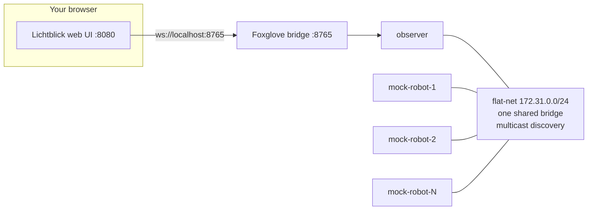
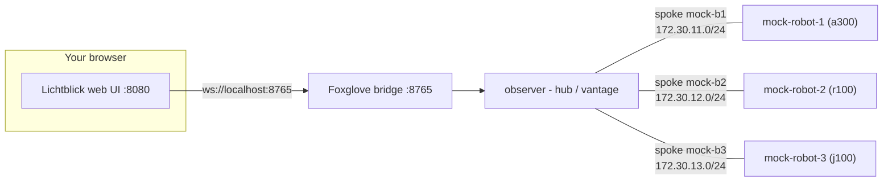
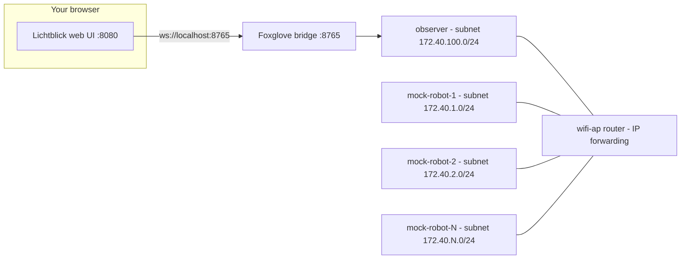

# Lab 1 — Configuration & Tuning

**Goal:** get familiar with the three containers every later lab is built on:
- the **mock robot**,
- the **observer**, and
- **Lichtblick**

And the single `scripts/workshop` entry point that drives them.

We wil begin from stock RMW defaults, then watch a real robot graph appear in an operator
view and see how `RMW_IMPLEMENTATION` and the per-vendor configuration files change
discovery and transport across a small fleet.

## Before you begin

Every command in this lab goes through one script: [`scripts/workshop`](../scripts/workshop).
Run it from the repository root:

```bash
scripts/workshop up                  # star: observer + 3 mock robots (default RMW: cyclone)
scripts/workshop observer bridge     # start the observer's Foxglove bridge on :8765
scripts/workshop lichtblick up       # bring up the Lichtblick web UI on :8080
```

Allow a few seconds for the robots to finish launching, then open Lichtblick pre-connected
to the observer's Foxglove bridge:

```
http://localhost:8080/?ds=foxglove-websocket&ds.url=ws://localhost:8765
```

Opening plain `http://localhost:8080` does **not** select the data source — use the full
URL above.

Import the Lichtblick layout, located at `docker/lichtblick/default.json`, by Navigating to Menu (top-left corner) -> View -> Import layout from file...

When you are done, tear everything down:

```bash
scripts/workshop lichtblick down
scripts/workshop down
```

## Topology

`scripts/workshop` can bring up three topologies, selected with `-t`. They share the same
robots, observer, and Lichtblick overlay — only the network between them changes. `up`
defaults to **star**; the whole workshop reuses these three shapes.

```bash
scripts/workshop -t flat up    # flat  (default N=3)
scripts/workshop -t star up    # star  (default, N=3)
scripts/workshop -t routed up  # routed (default N=15)
```

In every topology, Lichtblick runs in your browser and connects to the observer's Foxglove
bridge on `:8765`. The observer is the single vantage that sees the whole fleet.


### Flat

Every robot and the observer share **one** bridge (`flat-net`, `172.31.0.0/24`) with plain
multicast discovery. Discovery is automatic and plug-and-play, at the cost of chatter that
grows with the fleet. Scale it with `-t flat up <N>`.

Source: [`diagrams/flat.mmd`](diagrams/flat.mmd)



### Star

A hub-and-spoke topology. The observer sits at the centre and every robot shares a private
spoke (its `/24` subnet) with the observer *only*. The robots are mutually isolated. No
shared bus. So, discovery is hand-wired and quiet.

Source: [`diagrams/star.mmd`](diagrams/star.mmd)



### Routed

Every robot and the observer sits on its own `/24` subnet, and a `wifi-ap` router (IP forwarding)
is the only path between them, so **all** peer traffic crosses one shared, shapeable link.
This is the shared-medium model the next labs will stress with `ap_shape.sh`.
Multicast cannot cross the AP, so the generated configs use unicast peer lists.

Source: [`diagrams/routed.mmd`](diagrams/routed.mmd)



## The three primitives

### Mock robot

Each `mock-robot-<n>` is a self-contained ROS 2 mock robot. On startup it launches the mock
bringup, which publishes sensor topics and its own TF tree under a private namespace.

| Aspect | Details |
|---|---|
| Image | `ghcr.io/clearpathrobotics/roscon2026-mastering-the-jazzy-rmw:ubuntu-headless-latest` |
| Namespace / frame | `robot_<n>` / `robot<n>` (e.g. `mock-robot-1` → `/robot_1/...`, frame `robot1`) |
| Default models | robot-1 `a300`, robot-2 `r100`, robot-3 `j100` (override with `--model`) |
| Topics | `/camera/image_raw`, `/scan`, plus the robot's TF tree |
| Middleware | `RMW_IMPLEMENTATION` (default `rmw_cyclonedds_cpp`), selectable per run |

### Observer

The `observer` is the operator-side workstation. It sits at the hub of every spoke, so it
is the only node that reaches every robot. It comes up **idle** and you start tools on it on demand.

| Aspect | Details |
|---|---|
| Role | hub of the star; reaches every robot subnet |
| Default state | idle (`keepalive`) until you start a tool |
| Foxglove bridge | `workshop observer bridge` → publishes on host `:8765` |
| Ad-hoc tools | `workshop shell observer` then run `ros2` CLI (topics, nodes, TF) |

### Lichtblick

`lichtblick` serves the [Lichtblick](https://github.com/lichtblick-suite/lichtblick) web UI
with a joystick extension **pre-installed**, so you can visualize and drive the mock
robots without importing anything by hand.

| Aspect | Details |
|---|---|
| Port | `8080` on the host (override with `LICHTBLICK_PORT`) |
| Extensions | `joshnewans.joy-panel` (gamepad panel) |
| Connects via | the observer's Foxglove bridge — start it with `workshop observer bridge` first |
| Lifecycle | `workshop lichtblick up` / `workshop lichtblick down` (orthogonal to any topology) |

The extensions auto-install into the browser's IndexedDB on first page load. A browser that
has used Lichtblick before may keep an old layout — reopen the full connect URL if a panel
looks stale.

## Selecting and configuring the middleware

`workshop up` generates one config per node, per vendor, under
[`docker/rmw_configuration/star/`](../docker/rmw_configuration/):

```
rmw_configuration/star/
  cyclone/  mock-robot-1.xml   mock-robot-2.xml   mock-robot-3.xml   observer.xml
  fast/     mock-robot-1.xml   mock-robot-2.xml   mock-robot-3.xml   observer.xml
  zenoh/    mock-robot-1.json5 mock-robot-2.json5 mock-robot-3.json5 observer.json5
```

These files are regenerated every time you run `workshop up`, and are mounted read-only
into each container at `/rmw_configuration`.

### Pick the RMW for the whole fleet

Pass a shortened RMW name as the third argument to `up`. It sets `RMW_IMPLEMENTATION` for every
robot and the observer:

| Middleware | `up` argument | Impl string |
|---|---|---|
| Cyclone DDS | `cyclone` (default) | `rmw_cyclonedds_cpp` |
| Fast DDS | `fastdds` | `rmw_fastrtps_cpp` |
| Zenoh | `zenoh` | `rmw_zenoh_cpp` |

```bash
scripts/workshop up 3 fastdds        # whole fleet on Fast DDS
scripts/workshop up 3 zenoh          # whole fleet on Zenoh
```

`RMW_IMPLEMENTATION` binds when a node's participant is created, so switching RMW means
recreating the fleet. The observer can be pointed at a different config independently through `OBSERVER_RMW_IMPLEMENTATION` and `OBSERVER_CYCLONEDDS_URI` (etc.) if you want to compare a mixed setup.

### Other knobs

| Flag | Effect |
|---|---|
| `--model a300\|r100\|j100` | per-robot model; a single value applies to all, a list cycles across robots 1..N |
| `--build` | build the editable workspace in-container from `mock_robot_ws/src` (before the image exists) |
| `-t flat` | flat single-bridge topology (all robots + observer share one bus) — used in Exercise 3 |

## Exercises

### [1. Bring up your first robot](exercises/1_bring_up_your_first_robot.md)

Bring up a single mock robot behind the observer, start the bridge and Lichtblick, and find
the robot's topics and TF tree in the operator view.

### [2. Meet the observer](exercises/2_meet_the_observer.md)

Open a shell on the observer and use the `ros2` CLI to see the graph from the operator
vantage where the bridge runs.

### [3. Configure the RMW for the star](exercises/3_add_robots_and_watch_discovery.md)

Bring up the star topology that deliberately forces RMW configuration, then use Fast DDS's
`interfaceWhiteList` on the observer to grow its view of the fleet one spoke at a time.

### [4. Select and configure the RMW](exercises/4_select_and_configure_the_rmw.md)

Flip the fleet between Cyclone DDS, Fast DDS, and Zenoh, inspect the generated per-node
configs.

### [5. After the workshop](exercises/5_after_the_workshop.md)

Drive a robot with the joystick panel, try the `--model` and `--build` knobs, and take the
mock robot apart on your own.

---

**Next:** [Lab 2 — ROS 2 on the Wire](../lab2-on-the-wire/README.md).
