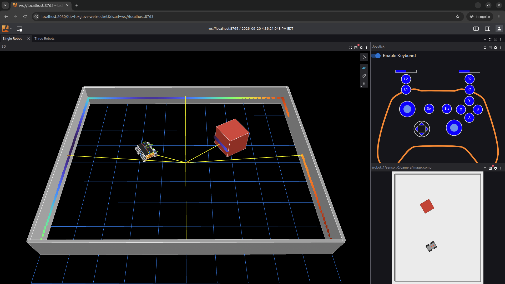

# 1. Bring up your first robot

Bring up the smallest useful setup: the **observer plus one mock robot**.
Start the observer's Foxglove bridge and view the robot in **Lichtblick**.

Make sure to change your directory to the repository root.

> **What you will visualize:** one mock robot's sensor topics and TF tree, streamed from
> the observer to Lichtblick. Later exercises add robots, swap the RMW, and drive the
> robot. For now, we will just confirm the basic building blocks all work.

## Steps

1. Bring up the **flat** topology with a **single** robot, so you bring up the `observer`
   and `mock-robot-1`. The flat bus is the easiest place to start: every node shares one
   bridge with plain multicast discovery, so nothing has to be hand-wired.

   ```bash
   MOCK_RUN_PILOT=false scripts/workshop -t flat up 1
   ```

   The robot launches the mock bringup on startup. The observer comes up **idle**, so it
   will not subscribe to anything until you start the Foxglove bridge.

   Each `mock-robot-<n>` is a self-contained ROS 2 mock robot. On startup it launches the mock
   bringup, which publishes sensor topics and its own TF tree under a private namespace.

   | Aspect | Details |
   |---|---|
   | Image | `ghcr.io/clearpathrobotics/roscon2026-mastering-the-jazzy-rmw:ubuntu-headless-latest` |
   | Namespace / frame | `robot_<n>` / `robot<n>` (e.g. `mock-robot-1` → `/robot_1/...`, frame `robot1`) |
   | Default models | robot-1 `a300`, robot-2 `r100`, robot-3 `j100` (override with `--model`) |
   | Topics | `/camera/image_raw`, `/scan`, plus the robot's TF tree |
   | Middleware | `RMW_IMPLEMENTATION` (default `rmw_cyclonedds_cpp`), selectable per run |

2. Start the observer's Foxglove bridge:

   ```bash
   scripts/workshop observer bridge
   ```

   It publishes on host port `8765`. The command prints the exact connect URL.

   The `observer` is the operator-side workstation. It sits at the hub of every spoke, so it is
   the only node that reaches every robot. It comes up **idle** and you start tools on it on
   demand.

   | Aspect | Details |
   |---|---|
   | Role | hub of the star; reaches every robot subnet |
   | Default state | idle (`keepalive`) until you start a tool |
   | Foxglove bridge | `workshop observer bridge` → publishes on host `:8765` |
   | Ad-hoc tools | `workshop shell observer` then run `ros2` CLI (topics, nodes, TF) |

3. Bring up Lichtblick (builds the image on first run):

   ```bash
   scripts/workshop lichtblick up
   ```

   `lichtblick` serves the [Lichtblick](https://github.com/lichtblick-suite/lichtblick) web UI
   with a joystick extension **pre-installed**, so you can visualize and drive the mock robots
   without importing anything by hand.

   | Aspect | Details |
   |---|---|
   | Port | `8080` on the host (override with `LICHTBLICK_PORT`) |
   | Extensions | `joshnewans.joy-panel` (gamepad panel) |
   | Connects via | the observer's Foxglove bridge — start it with `workshop observer bridge` first |
   | Lifecycle | `workshop lichtblick up` / `workshop lichtblick down` (orthogonal to any topology) |

4. Open Lichtblick pre-connected to the observer's bridge:

   ```
   http://localhost:8080/?ds=foxglove-websocket&ds.url=ws://localhost:8765
   ```

   > Use the full URL. The plain `http://localhost:8080` does not select the data source.

   


## Tear down

Leave everything up for [Exercise 2](2_inspect_the_robot_and_its_qos.md), or tear it down:

```bash
scripts/workshop lichtblick down
scripts/workshop -t flat down
```

**Next:** [2. Inspect the robot and its QoS](2_inspect_the_robot_and_its_qos.md)
