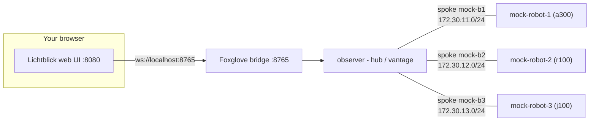

# 3. Configure the RMW for the star

The flat bus in Exercises 1–2 is the common case: robots on a switch or a shared network,
plain multicast, and discovery that just works with zero configuration. The **star** is the
opposite. Each robot sits alone on its own `/24` spoke with the observer, and multicast
does **not** cross between spokes, so discovery does not just work.
You have to configure the RMW to tell it which interfaces to bind and discover on. This
exercise uses a topology that deliberately forces that configuration.

Uses **Fast DDS**. Start from the repository root.



> **What you will visualize:** the observer's view of the fleet grow from **one → two →
> three** robots as you whitelist one, two, then all three of its spoke interfaces in the
> Fast DDS config. On the star, the observer's interface whitelist *is* its reach.

## The Fast DDS config file and the env var that selects it

Each container gets its own Fast DDS profile file, generated by `workshop up` and mounted
read-only inside the container at `/rmw_configuration/star/fast/<node>.xml`. Fast DDS is
pointed at it by one environment variable, **`FASTRTPS_DEFAULT_PROFILES_FILE`** (Cyclone's
equivalent is `CYCLONEDDS_URI`, Zenoh's is `ZENOH_SESSION_CONFIG_URI`). On the star, the
generated compose file sets it per node — for the observer:

```
FASTRTPS_DEFAULT_PROFILES_FILE: /rmw_configuration/star/fast/observer.xml
```

Inside that file, the element that matters here is `<interfaceWhiteList>`:

```xml
<transport_descriptor>
  <transport_id>udp_pin</transport_id>
  <type>UDPv4</type>
  <interfaceWhiteList>
    <address>OBSERVER_IP_BR1</address>   <!-- interface into robot 1's spoke -->
    <address>OBSERVER_IP_BR1</address>   <!-- interface into robot 2's spoke -->
    <address>OBSERVER_IP_BR1</address>   <!-- interface into robot 3's spoke -->
  </interfaceWhiteList>
</transport_descriptor>
```

`interfaceWhiteList` restricts Fast DDS to bind and run discovery on *exactly* those
interfaces. The observer has one leg into each robot's `/24`, so on the star this list is
literally the set of robots the observer can discover — one address per spoke.

## Steps

1. Bring the star up on Fast DDS with **placeholder** configs using `--partial-gen`, so the
   RMW configs are written with editable tokens instead of real IPs:

   ```bash
   scripts/workshop -t star up 3 fastdds --partial-gen
   ```

   The fleet starts, but **nothing discovers anything** — the configs hold placeholder
   tokens, not addresses. This is the unconfigured star; your job is to fill it in.

2. Look at the placeholders. The observer's whitelist reads:

   ```bash
   cat docker/rmw_configuration/star/fast/observer.xml
   ```

   ```xml
   <interfaceWhiteList>
     <address>OBSERVER_IP_BR1</address>
     <address>OBSERVER_IP_BR2</address>
     <address>OBSERVER_IP_BR3</address>
   </interfaceWhiteList>
   ```

   and each robot's file pins its own address:

   ```bash
   cat docker/rmw_configuration/star/fast/mock-robot-1.xml   # <address>MOCK_ROBOT_1_IP</address>
   ```

   `OBSERVER_IP_BR<k>` is the observer's leg on spoke *k*; `MOCK_ROBOT_<k>_IP` is robot *k*'s
   own address on that same spoke.

3. Deduce the real values by reading them **live from the containers**. Shell into each robot and print its interface name and address:

   ```bash
   scripts/workshop shell mock-robot-1
   ip -4 -brief addr show      # e.g.  eth0  UP  172.30.11.11/24
   exit
   ```

   Repeat for `mock-robot-2` and `mock-robot-3`. Each robot's `eth0` address is its own
   `MOCK_ROBOT_<k>_IP`, and its `/24` is that robot's spoke. The whitelist you are editing is
   the observer's, so read its three legs the same way — shell into the observer and note one
   address per spoke:

   ```bash
   scripts/workshop shell observer
   ip -4 -brief addr show      # one leg per spoke: 172.30.11.20 / .12.20 / .13.20
   exit
   ```

   You should find:
   | Spoke | `MOCK_ROBOT_<k>_IP` (robot's `eth0`) | `OBSERVER_IP_BR<k>` (observer's leg) |
   |---|---|---|
   | 1 | `172.30.11.11` | `172.30.11.20` |
   | 2 | `172.30.12.12` | `172.30.12.20` |
   | 3 | `172.30.13.13` | `172.30.13.20` |

4. Configure the robots, and give the observer **one** interface to start with. Fill each
   robot file's placeholder with its real address, and edit `observer.xml` so its whitelist
   has **only robot 1's spoke**:

   ```xml
   <!-- docker/rmw_configuration/star/fast/mock-robot-1.xml --> <address>172.30.11.11</address>
   <!-- docker/rmw_configuration/star/fast/mock-robot-2.xml --> <address>172.30.12.12</address>
   <!-- docker/rmw_configuration/star/fast/mock-robot-3.xml --> <address>172.30.13.13</address>

   <!-- docker/rmw_configuration/star/fast/observer.xml -->
   <interfaceWhiteList>
     <address>172.30.11.20</address>
   </interfaceWhiteList>
   ```

   Bring the stack up reusing your hand-edited configs — `--skip-gen` recreates the
   containers so they re-read the files, without regenerating them:

   ```bash
   scripts/workshop -t star up 3 fastdds --skip-gen
   ```

5. Probe the observer's view. Open a shell and list the graph with a fresh, daemon-free
   participant so it re-reads the config every time:

   ```bash
   scripts/workshop shell observer
   source /opt/ros/jazzy/setup.bash && source /mock_robot_ws/install/setup.bash
   ros2 node list --no-daemon | sort      # only robot_1 — discovery runs on one spoke
   ```

   With a single whitelisted interface, the observer only runs discovery on robot 1's spoke,
   so it sees **only robot 1**. (Give discovery a second and re-run if the list is empty.)

6. Now widen the observer's reach one spoke at a time — **without restarting anything**.
   Each `ros2 node list --no-daemon` starts a fresh participant that re-reads `observer.xml`,
   so you just edit the file on the host and re-run the probe. Add robot 2's leg:

   ```xml
   <interfaceWhiteList>
     <address>172.30.11.20</address>
     <address>172.30.12.20</address>
   </interfaceWhiteList>
   ```

   ```bash
   ros2 node list --no-daemon | sort      # robot_1 and robot_2 now
   ```

   Add the third address and probe again — the observer now reaches all three:

   ```xml
   <interfaceWhiteList>
     <address>172.30.11.20</address>
     <address>172.30.12.20</address>
     <address>172.30.13.20</address>
   </interfaceWhiteList>
   ```

   ```bash
   ros2 node list --no-daemon | sort      # robot_1, robot_2, robot_3
   exit
   ```

<details>
<summary>Answer: why the star forces you to configure the RMW</summary>

On a flat switch every node shares one broadcast domain, and SIMPLE discovery's multicast
reaches everyone with no configuration — which is why it is the common deployment. The star
has no shared segment: each robot is alone on its `/24` spoke and multicast does not route
between spokes, so an out-of-the-box RMW discovers nothing across the fleet. You bridge the
spokes by hand, at the observer, with `interfaceWhiteList`: each address you add is one more
spoke the observer binds and runs discovery on, hence one more robot it can see. That is the
lever the later labs reach for — the observer is the one node wired into every spoke, so it
is where a single config change visibly changes what the whole system can discover.

</details>

## Tear down

```bash
scripts/workshop -t star down
```

**Next:** [4. Select and configure the RMW](4_select_and_configure_the_rmw.md)
