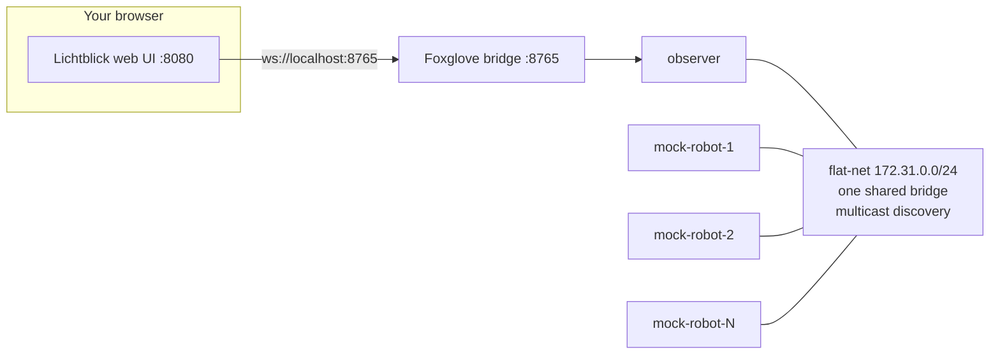
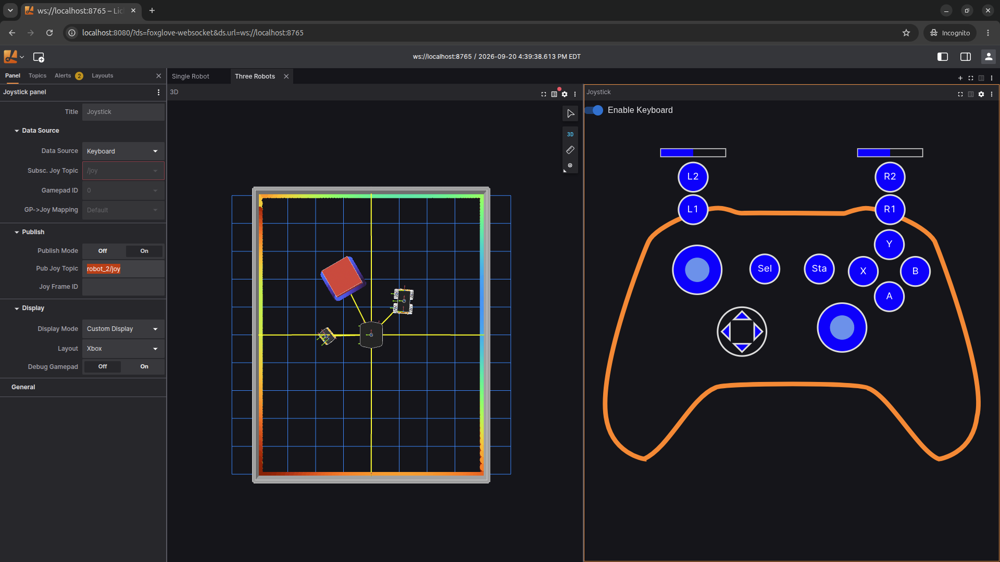

# 3. Fleet discovery and domain isolation

Now bring up a **small fleet** and look at *how* the nodes find each other. On the flat bus
discovery "just works" and every robot sees every other robot. In this exercise you first prove
that from the config, then use `ROS_DOMAIN_ID` to carve the fleet into isolated domains so a
robot can no longer see its neighbours.

Uses **Cyclone DDS** on the flat topology. Start from the repository root.

> **What you will visualize:** the ROS graph as text — first one shared graph where every
> robot discovers every other, then, after splitting the fleet by domain, a graph where the
> observer sees only the single robot whose domain it joins.

The flat topology — every robot and the observer share one bridge with plain multicast
discovery:



## Steps

1. Bring up **three robots**, one of each model — `a300`, `j100`, `r100` — on the flat bus
   with Cyclone DDS. `--model` assigns the list to robots 1..N in order:

   ```bash
   MOCK_RUN_PILOT=false scripts/workshop -t flat up 3 cyclone --model a300,j100,r100
   ```

   `mock-robot-1` is the `a300`, `mock-robot-2` the `j100`, `mock-robot-3` the `r100`.

2. Confirm every robot sees every other robot. Shell into one and list the graph:

   ```bash
   scripts/workshop shell mock-robot-1
   ros2 topic list
   ros2 node list
   exit
   ```

   `mock-robot-1` sees `/robot_1/...`, `/robot_2/...`, **and** `/robot_3/...` — not just its
   own. Every robot has the full fleet graph.

3. **(Optional)** Watch the fleet in Lichtblick. Start the observer's Foxglove bridge, bring
   Lichtblick up, and open it pre-connected to the bridge, then select the **Three Robots**
   tab to see all three robots at once:

   ```bash
   scripts/workshop observer bridge
   scripts/workshop lichtblick up
   # http://localhost:8080/?ds=foxglove-websocket&ds.url=ws://localhost:8765
   ```

   

4. Now inspect the **RMW configuration** the harness generated to understand *why*. Look at
   the robot and observer Cyclone profiles on the flat topology:

   ```bash
   cat docker/rmw_configuration/flat/cyclone/mock-robot.xml
   cat docker/rmw_configuration/flat/cyclone/observer.xml
   ```

   > **Can all robots see all of the other robots' topics? How is that happening?** Yes.
   > Both files set `<AllowMulticast>true</AllowMulticast>`, pin **no** interface, and list
   > **no** `<Peers>`. Every node is on one shared bridge (`flat-net`, `172.31.0.0/24`) and
   > runs SIMPLE discovery over **multicast**: each participant announces itself to the whole
   > segment and hears everyone else's announcements. No addresses are hand-wired. The shared
   > broadcast domain does all the work. This is exactly why a flat network is plug-and-play.

5. Split the fleet by **domain**. Bring the robots down:

   ```bash
   scripts/workshop -t flat down
   ```

   `ROS_DOMAIN_ID` selects a completely separate DDS partition. Participants on different
   domains use different multicast ports and **never** discover each other. The generated
   compose gives every service the same domain from one variable:

   ```yaml
   ROS_DOMAIN_ID: "${ROS_DOMAIN_ID:-25}"
   ```

   Edit `docker/compose/flat.yml` and give **each robot its own** domain — set the
   `ROS_DOMAIN_ID` line under `mock-robot-1` to `1`, `mock-robot-2` to `2`, and
   `mock-robot-3` to `3` (leave the observer at `25`):

   ```yaml
   # under mock-robot-1:
       ROS_DOMAIN_ID: "1"
   # under mock-robot-2:
       ROS_DOMAIN_ID: "2"
   # under mock-robot-3:
       ROS_DOMAIN_ID: "3"
   ```

   Bring the fleet back up reusing your edited compose file. Make sure to use `--skip-gen` to recreate the
   containers without regenerating the file:

   ```bash
   MOCK_RUN_PILOT=false scripts/workshop -t flat up 3 cyclone --skip-gen
   ```

6. Shell into the observer and hop between domains. Each robot now lives alone on its own
   domain, so you see **one robot at a time** depending on the domain you join:

   ```bash
   scripts/workshop shell observer

   export ROS_DOMAIN_ID=1
   ros2 node list --no-daemon --spin-time 5      # only robot_1 (the a300)

   export ROS_DOMAIN_ID=2
   ros2 node list --no-daemon --spin-time 5      # only robot_2 (the j100)

   export ROS_DOMAIN_ID=3
   ros2 node list --no-daemon --spin-time 5      # only robot_3 (the r100)
   exit
   ```

   Use `--no-daemon` so each call starts a fresh participant on the current domain instead of
   reusing a cached daemon. The robots can no longer see each other either. `mock-robot-1`
   on domain 1 shares no domain with `mock-robot-2` or `mock-robot-3`, so its graph is now
   just its own.

> **Discovery still happens but now per domain.** Splitting by domain isolates *who* discovers
> whom, but it does **not** turn discovery off. Inside each domain the nodes still run the
> full multicast SIMPLE discovery handshake (SPDP announcements plus SEDP endpoint exchange).
> Scale that up to many robots, a fleet of robots, each with dozens of topics, services, and actions, and every
> participant floods its domain with a large burst of discovery UDP traffic on startup and
> keeps re-announcing periodically. That discovery cost, not the application data, is what
> the later labs stress and what the next exercise starts to tame.

## Move on to the next exercise

Bring the fleet down before continuing:

```bash
scripts/workshop -t flat down
```

**Next:** [4. Disable multicast and pin peers](4_disable_multicast_and_pin_peers.md)
