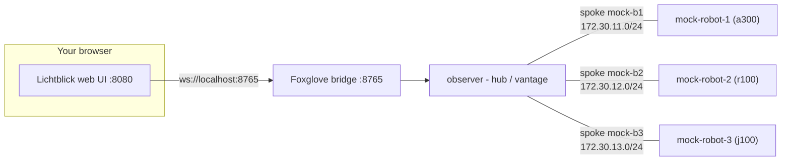

# 5. Configure the RMW for the star

The flat bus in Exercises 1–4 is the common case: robots on a switch or a shared network,
plain multicast, and discovery that just works with zero configuration. The **star** is the
opposite. Each robot sits alone on its own `/24` spoke with the observer, and multicast
does **not** cross between spokes, so discovery does not just work. You have to configure the
RMW to tell it which interfaces to bind and discover on and here the *choice* of RMW
suddenly matters.

You will see it in three moves: **Cyclone DDS**, the easiest RMW to set up, falls short on
this uncommon multi-homed layout. **Fast DDS** handles it once you whitelist the observer's
spoke interfaces.Finally, you turn **multicast off entirely** and drive discovery purely
from a pinned peer list. Start from the repository root.



> **What you will visualize:** the observer's view of the fleet narrow to a **single** robot —
> and swap between robot 1, 2, and 3 — as you trim its interface whitelist to one spoke, then
> widen it back to all three. On the star, the observer's interface whitelist *is* its reach.

## First, try Cyclone DDS — and watch it fall short

Cyclone is the default RMW and the least fussy to configure, so it is the natural first thing
to reach for. Bring the star up on Cyclone and look from the observer:

```bash
MOCK_RUN_PILOT=false scripts/workshop -t star up 3 cyclone
scripts/workshop shell observer
ros2 node list --no-daemon --spin-time 5
exit
```

The generated Cyclone config already turns multicast off and lists every robot as a unicast
`<Peer>`, and it pins the observer to all three spoke legs (`172.30.11.20`, `172.30.12.20`,
`172.30.13.20`):

```bash
cat docker/rmw_configuration/star/cyclone/observer.xml
```

Yet the observer still **does not discover the whole fleet**. You get at most the robot on a
single spoke, often none. Cyclone DDS binds and runs discovery on effectively **one** network
interface, so even though the config names all three legs, it can only reach the spoke it
single-homes on. The star needs the hub to be genuinely multi-homed.  One bound interface per
spoke and that is exactly what Cyclone does not give you here.

That is the lesson: the "easiest" RMW is not always the right one. Tear the Cyclone fleet
down and switch to Fast DDS, which multi-homes across all three spokes.

```bash
scripts/workshop -t star down
```

## The Fast DDS config file and the env var that selects it

Each container gets its own Fast DDS profile file, generated by `workshop up` and mounted
read-only inside the container at `/rmw_configuration/star/fast/<node>.xml`. Fast DDS is
pointed at it by one environment variable, **`FASTRTPS_DEFAULT_PROFILES_FILE`** (Cyclone's
equivalent is `CYCLONEDDS_URI`, Zenoh's is `ZENOH_SESSION_CONFIG_URI`). On the star, the
generated compose file sets it per node — for the observer:

```
FASTRTPS_DEFAULT_PROFILES_FILE: /rmw_configuration/star/fast/observer.xml
```

Inside that file, the element that matters here is `<interfaceWhiteList>`:

```xml
<transport_descriptor>
  <transport_id>udp_pin</transport_id>
  <type>UDPv4</type>
  <interfaceWhiteList>
    <address>172.30.11.20</address>   <!-- interface into robot 1's spoke -->
    <address>172.30.12.20</address>   <!-- interface into robot 2's spoke -->
    <address>172.30.13.20</address>   <!-- interface into robot 3's spoke -->
  </interfaceWhiteList>
</transport_descriptor>
```

`interfaceWhiteList` restricts Fast DDS to bind and run discovery on *exactly* those
interfaces. The observer has one leg into each robot's `/24`, so on the star this list is
literally the set of robots the observer can discover — one address per spoke.

## Steps

1. Bring the star up on Fast DDS with the **normal** generated configs — every container's
   real spoke address is written in for you:

   ```bash
   MOCK_RUN_PILOT=false scripts/workshop -t star up 3 fastdds
   ```

   Out of the box the observer's whitelist already lists all three spoke legs, so it discovers
   the whole fleet.

2. Look at the generated observer whitelist:

   ```bash
   cat docker/rmw_configuration/star/fast/observer.xml
   ```

   ```xml
   <interfaceWhiteList>
     <address>172.30.11.20</address>   <!-- observer's leg on robot 1's spoke -->
     <address>172.30.12.20</address>   <!-- observer's leg on robot 2's spoke -->
     <address>172.30.13.20</address>   <!-- observer's leg on robot 3's spoke -->
   </interfaceWhiteList>
   ```

   Each address is the observer's own leg into one robot's `/24`:

   | Spoke | Robot's `eth0` | Observer's leg (whitelist entry) |
   |---|---|---|
   | 1 | `172.30.11.11` | `172.30.11.20` |
   | 2 | `172.30.12.12` | `172.30.12.20` |
   | 3 | `172.30.13.13` | `172.30.13.20` |

   Confirm the observer sees all three:

   ```bash
   scripts/workshop shell observer
   ros2 node list --no-daemon --spin-time 5       # robot_1, robot_2, robot_3
   ```

3. **Isolate a single robot** by trimming the whitelist to **one** interface. Edit only
   `docker/rmw_configuration/star/fast/observer.xml` so it keeps just robot 1's leg:

   ```xml
   <interfaceWhiteList>
     <address>172.30.11.20</address>
   </interfaceWhiteList>
   ```

   A fresh `ros2 node list --no-daemon --spin-time 5` re-reads `observer.xml` every time, so nothing needs
   restarting — edit the file on the host and re-probe from the observer shell. However, in certain cases,
   if discovery takes too long, only a few nodes will be discovered. In that case, use `--spin-time` to increase:

   ```bash
   ros2 node list --no-daemon --spin-time 5       # only robot_1 — the one spoke it binds
   ```

   Now **swap** that single address to pick a different robot: `172.30.12.20` isolates
   **robot 2**, `172.30.13.20` isolates **robot 3**. Edit
   `docker/rmw_configuration/star/fast/observer.xml`, re-probe, and only that robot appears:

   ```bash
   ros2 node list --no-daemon --spin-time 5       # after each swap: only robot_2, then only robot_3
   ```

4. **Widen back to the whole fleet.** Put all three legs back in
   `docker/rmw_configuration/star/fast/observer.xml` so the observer binds every spoke again:

   ```xml
   <interfaceWhiteList>
     <address>172.30.11.20</address>
     <address>172.30.12.20</address>
     <address>172.30.13.20</address>
   </interfaceWhiteList>
   ```

   ```bash
   ros2 node list --no-daemon --spin-time 5       # robot_1, robot_2, robot_3
   exit
   ```

<details>
<summary>Answer: why the star forces you to configure the RMW</summary>

On a flat switch every node shares one broadcast domain, and SIMPLE discovery's multicast
reaches everyone with no configuration. Which is why it is the common deployment. The star
has no shared segment: each robot is alone on its `/24` spoke and multicast does not route
between spokes, so an out-of-the-box RMW discovers nothing across the fleet. You bridge the
spokes by hand, at the observer, with `interfaceWhiteList`: each address you add is one more
spoke the observer binds and runs discovery on, hence one more robot it can see. That is the
lever the later labs reach for — the observer is the one node wired into every spoke, so it
is where a single config change visibly changes what the whole system can discover.

</details>

## Then, turn multicast off entirely (`--skip-gen`)

The whitelist above still leans on **multicast** for the SPDP discovery handshake within each
spoke `/24`. You can go one step further and remove multicast completely: give Fast DDS an
explicit **metatraffic unicast locator**, which stops it listening for multicast discovery,
plus an **initial peers** list, which sends its announcements straight to the addresses you
name. Edit the same per-node profiles you configured above, then bring the stack back up with
`--skip-gen`.

1. Edit `docker/rmw_configuration/star/fast/observer.xml` and add the two lists **inside the
   existing `<builtin>` element** — right after the `</discovery_config>` line. The anchor
   comments below name tags that are **already in the file**, so you know exactly where the
   new lines slot in:

   ```xml
   <!-- </discovery_config>  (already in the file — add the two lists right after it) -->
   <!-- Own metatraffic unicast locators, one per spoke leg. Defining these
        suppresses the default multicast metatraffic locator. -->
   <metatrafficUnicastLocatorList>
     <locator><udpv4><address>172.30.11.20</address></udpv4></locator>
     <locator><udpv4><address>172.30.12.20</address></udpv4></locator>
     <locator><udpv4><address>172.30.13.20</address></udpv4></locator>
   </metatrafficUnicastLocatorList>
   <!-- Send discovery straight to each robot's spoke address. -->
   <initialPeersList>
     <locator><udpv4><address>172.30.11.11</address></udpv4></locator>
     <locator><udpv4><address>172.30.12.12</address></udpv4></locator>
     <locator><udpv4><address>172.30.13.13</address></udpv4></locator>
   </initialPeersList>
   <!-- </builtin>  (already in the file — the lists above go before it) -->
   ```

2. Still in `observer.xml`, add one more line **inside the `<transport_descriptor>`**, right
   after the whitelist. Without it Fast DDS only probes **4** participant ports per peer, but
   each robot runs more than four participants (one per node) — so the observer would discover
   only *some* of each robot's nodes:

   ```xml
   <!-- </interfaceWhiteList>  (already in the file — add the line below right after it) -->
   <maxInitialPeersRange>30</maxInitialPeersRange>   <!-- probe 30 participant ports per peer, not 4 -->
   <!-- </transport_descriptor>  (already in the file — the line above goes before it) -->
   ```

3. Edit each `docker/rmw_configuration/star/fast/mock-robot-<k>.xml` the same way — the
   `maxInitialPeersRange` line plus the two builtin lists. Each robot listens on its own spoke
   address and dials only the observer's leg on that spoke — for `mock-robot-1.xml`:

   ```xml
   <!-- </interfaceWhiteList>  (already in the file — add the line below right after it) -->
   <maxInitialPeersRange>30</maxInitialPeersRange>   <!-- probe 30 participant ports per peer, not 4 -->
   <!-- </transport_descriptor>  (already in the file) -->

   <!-- </discovery_config>  (already in the file — add the two lists right after it) -->
   <metatrafficUnicastLocatorList>
     <locator><udpv4><address>172.30.11.11</address></udpv4></locator>
   </metatrafficUnicastLocatorList>
   <initialPeersList>
     <locator><udpv4><address>172.30.11.20</address></udpv4></locator>
   </initialPeersList>
   <!-- </builtin>  (already in the file — the lists above go before it) -->
   ```

   Do the same for `mock-robot-2.xml` (own `172.30.12.12`, observer `172.30.12.20`) and
   `mock-robot-3.xml` (own `172.30.13.13`, observer `172.30.13.20`).

4. Bring the stack up reusing your hand-edited configs — `--skip-gen` recreates the
   containers so they re-read the files, without regenerating them:

   ```bash
   MOCK_RUN_PILOT=false scripts/workshop -t star up 3 fastdds --skip-gen
   ```

5. Confirm topics still flow with multicast fully off:

   ```bash
   scripts/workshop shell observer
   ros2 node list --no-daemon --spin-time 5       # robot_1, robot_2, robot_3
   ros2 topic echo --once /robot_1/scan   # data arrives over unicast only
   exit
   ```

   The observer discovers and receives from all three robots without a single multicast
   packet — every SPDP announcement went straight to a pinned unicast address, and each
   participant listens for discovery only on its own metatraffic unicast locators.

## Tear down

```bash
scripts/workshop -t star down
```

**Next:** [6. Configure Zenoh on the flat bus](6_configure_zenoh.md)
