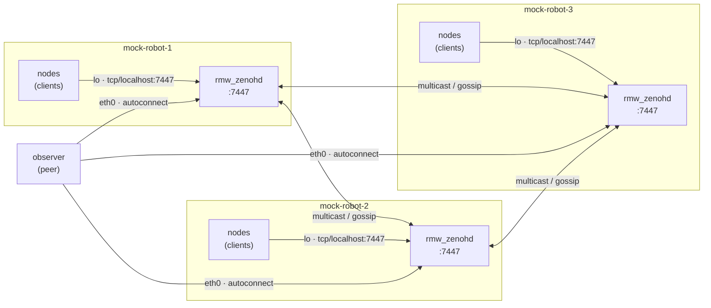

# 6. Configure Zenoh on the flat bus

Cyclone and Fast DDS are DDS implementations that discover peers directly. **Zenoh** is
different: `rmw_zenoh_cpp` is **router-based**. Every node opens a *session* to a Zenoh
**router** (`rmw_zenohd`), and the routers form the fabric that carries the graph. On the
flat bus this means a little wiring you do not have with DDS and one lever DDS does not
give you: **per-link downsampling** on the router.

Uses **Zenoh**. Start from the repository root.

> **What you will visualize:** the observer discovering all three robots through their Zenoh
> routers, then the same camera topic delivered at **full rate on the robot** but throttled to
> **1 Hz on the wire** to the observer — a router-side downsample that DDS cannot express.



> Each robot's nodes are **clients** of a **local** router over loopback (`lo`); the routers
> find each other over multicast/gossip on the flat bus; and the **observer peer**
> auto-connects to every router across `eth0` to see the whole fleet.

## The three Zenoh configs on the flat bus

The harness generates one shared session config per role plus a router config, under
`docker/rmw_configuration/flat/zenoh/`. Bring the fleet up first so the files exist:

```bash
MOCK_RUN_PILOT=false scripts/workshop -t flat up 3 zenoh
```

**1. Each robot runs its own router** `mock-robot-router.json5` (shared by all robots). It
listens on `:7447`, and on the flat bus finds the other routers and the observer over
multicast/gossip, auto-connecting to anything that scouts in:

```bash
cat docker/rmw_configuration/flat/zenoh/mock-robot-router.json5
```

```json5
{
  mode: "router",
  listen: { endpoints: ["tcp/0.0.0.0:7447"] },
  scouting: {
    multicast: { enabled: true, autoconnect: { router: ["router", "peer"], peer: ["router", "peer"] } },
    gossip:    { enabled: true, autoconnect: { router: ["router", "peer"], peer: ["router", "peer"] } },
  },
  transport: { shared_memory: { enabled: false } },
}
```

**2. Each robot's nodes are clients of that local router** — `mock-robot.json5`. They connect
straight to `tcp/localhost:7447`, i.e. their own router over loopback:

```bash
cat docker/rmw_configuration/flat/zenoh/mock-robot.json5
```

```json5
{
  mode: "client",
  connect: { endpoints: ["tcp/localhost:7447"] },
  timestamping: { enabled: true },
  transport: { shared_memory: { enabled: false } },
}
```

**3. The observer is a peer that finds every router** `observer.json5`. It runs no router
of its own; it scouts the flat bus over multicast and gossip and auto-connects to each
robot's router, so it sees the whole fleet's topics:

```bash
cat docker/rmw_configuration/flat/zenoh/observer.json5
```

```json5
{
  mode: "peer",
  scouting: {
    multicast: { enabled: true, autoconnect: { router: ["router", "peer"], peer: ["router", "peer"] } },
    gossip:    { enabled: true, autoconnect: { router: ["router", "peer"], peer: ["router", "peer"] } },
  },
  transport: { shared_memory: { enabled: false } },
}
```

Confirm the observer sees all three robots through their routers:

```bash
scripts/workshop shell observer
ros2 topic list        # /robot_1/..., /robot_2/..., /robot_3/...
ros2 node list
exit
```

## Does it make sense to run a router *per robot*?

Yes! Each robot's nodes are clients of a **local** router over loopback, so the robot keeps
working as a self-contained graph even if the link to the observer drops. Nothing on the robot
depends on a remote hub being reachable. On the flat bus the routers find each other for free:
multicast scouting plus gossip means you wire **nothing** by hand, and the observer joins the same way.

The alternative, one **central** router that every robot dials, is simpler to draw but makes
that router a single point of failure and a bottleneck: if it dies, every robot loses its
graph at once, and all traffic funnels through one process. Per-robot routers cost a little
extra memory per robot in exchange for locality and resilience, which is usually the right
trade for a fleet. (The same reasoning is why the star and routed topologies also give every
robot its own router.)

## Downsample the camera on the wire, keep it full-rate on the robot

Because every topic crosses the robot's **router** on its way out, the router is the natural
place to throttle *what leaves the robot* without touching what stays on it. Zenoh's
`downsampling` block does exactly that: it applies rate limits to a **flow** on a chosen
**interface**, so you can rate-limit only the traffic egressing toward the observer.

The robot's NIC toward the observer is `eth0`; its local clients reach the router over
loopback (`lo`). Downsampling on **egress** on **`eth0`** therefore throttles only what the
robot sends to the observer. On-robot subscribers, reading over `lo`, still get every frame.

1. Edit `docker/rmw_configuration/flat/zenoh/mock-robot-router.json5` and add a
   `downsampling` block (all robots share this file, so every robot's wire link is throttled):

   ```json5
   {
     mode: "router",
     listen: { endpoints: ["tcp/0.0.0.0:7447"] },
     scouting: {
       multicast: { enabled: true, autoconnect: { router: ["router", "peer"], peer: ["router", "peer"] } },
       gossip:    { enabled: true, autoconnect: { router: ["router", "peer"], peer: ["router", "peer"] } },
     },
     downsampling: [
       {
         id: "image_1hz_wire",
         interfaces: ["eth0"],      // only the NIC toward the observer; lo is excluded
         flows: ["egress"],
         messages: ["put"],
         rules: [
           { key_expr: "**/camera/image_raw/**", freq: 1.0 },
         ],
       },
     ],
     transport: { shared_memory: { enabled: false } },
   }
   ```

2. Bring the fleet back up reusing your edited config — `--skip-gen` recreates the containers
   so their routers re-read the file, without regenerating it:

   ```bash
   scripts/workshop -t flat down
   MOCK_RUN_PILOT=false scripts/workshop -t flat up 3 zenoh --skip-gen
   ```

3. Compare the camera rate **on the robot** versus **on the observer**. On the robot it is
   unchanged:

   ```bash
   scripts/workshop shell mock-robot-1
   ros2 topic hz /robot_1/sensor_0/camera/image_raw    # full sensor rate; Ctrl-C to stop
   exit
   ```

   From the observer, the same topic now arrives at ~1 Hz:

   ```bash
   scripts/workshop shell observer
   ros2 topic hz /robot_1/sensor_0/camera/image_raw    # ~1.0 Hz; Ctrl-C to stop
   exit
   ```

   The camera still publishes at full rate, and anything reading it *on* the robot still gets
   every frame — but the router drops all but ~1 frame per second on the way out `eth0`. This
   is exactly what you want for a bandwidth-heavy topic that a remote operator only needs to
   glance at: keep it rich where compute is local, thin it out over the shared link.

## Then, do the same on the star

On the flat bus the observer found every router for free over multicast. The **star** has no
shared segment and multicast is off, so — exactly like Fast DDS in [Exercise
5](5_configure_the_rmw_for_the_star.md) — the observer has to be told **explicitly** which
robots to reach. For Zenoh that list is the observer peer's **`connect.endpoints`**: one
`tcp/<robot-spoke-ip>:7447` per robot router. It is the Zenoh counterpart of the Fast DDS
`interfaceWhiteList` — the set of robots the observer can see. You will trim it to a single
robot and grow it back to all three.

1. Bring the flat fleet down and bring the star up on Zenoh (the two fleets share container
   names, so only one runs at a time):

   ```bash
   scripts/workshop  down
   MOCK_RUN_PILOT=false scripts/workshop -t star up 3 zenoh
   ```

   Each robot still runs its **own** router, but now listening on its private spoke; the
   observer is a peer that **dials** every robot's router because nothing is discoverable
   automatically across the spokes.

2. Look at the observer's config. Multicast is off; discovery is driven entirely by the
   explicit `connect.endpoints` list — one router per robot (abridged):

   ```bash
   cat docker/rmw_configuration/star/zenoh/observer.json5
   ```

   ```json5
   {
     mode: "peer",
     scouting: {
       multicast: { enabled: false, ... },   // no shared segment: nothing is scouted
       gossip:    { enabled: true,  ... },
     },
     connect: { endpoints: [
       "tcp/172.30.11.11:7447",   // mock-robot-1's router
       "tcp/172.30.12.12:7447",   // mock-robot-2's router
       "tcp/172.30.13.13:7447",   // mock-robot-3's router
     ] },
     listen: { endpoints: [       // the observer's own leg on each spoke
       "tcp/172.30.11.20:7447",
       "tcp/172.30.12.20:7447",
       "tcp/172.30.13.20:7447",
     ] },
     transport: { shared_memory: { enabled: false } },
   }
   ```

3. Narrow the observer to a **single** robot. Edit `connect.endpoints` in
   `docker/rmw_configuration/star/zenoh/observer.json5` so it lists only robot 1:

   ```json5
   connect: { endpoints: ["tcp/172.30.11.11:7447"] },
   ```

   Then probe from a fresh, daemon-free session that re-reads the config each time — no restart
   needed, just as in Exercise 5:

   ```bash
   scripts/workshop shell observer
   ros2 node list --no-daemon --spin-time 5      # only robot_1 — the one router it dials
   ```

4. Widen the observer's reach one robot at a time by editing `connect.endpoints` in
   `docker/rmw_configuration/star/zenoh/observer.json5` on the host and re-probing. Add robot
   2's router:

   ```json5
   connect: { endpoints: ["tcp/172.30.11.11:7447", "tcp/172.30.12.12:7447"] },
   ```

   ```bash
   ros2 node list --no-daemon --spin-time 5      # robot_1 and robot_2 now
   ```

   Add the third and probe again — the observer now reaches all three:

   ```json5
   connect: { endpoints: ["tcp/172.30.11.11:7447", "tcp/172.30.12.12:7447", "tcp/172.30.13.13:7447"] },
   ```

   ```bash
   ros2 node list --no-daemon --spin-time 5      # robot_1, robot_2, robot_3
   exit
   ```

Because multicast is off and each robot's router sits alone on its spoke dialing nobody, the
robot routers form no mesh — the only path to any of them is the observer's own session. So the
observer's `connect.endpoints` list *is* its reach: every endpoint you add is one more robot's
router it opens a session to, exactly the lever the Fast DDS `interfaceWhiteList` gave you in
Exercise 5.

## Tear down

```bash
scripts/workshop -t flat down
scripts/workshop -t star down
```

**Next:** [Lab 2 — ROS 2 on the Wire](../../lab2-on-the-wire/README.md)
