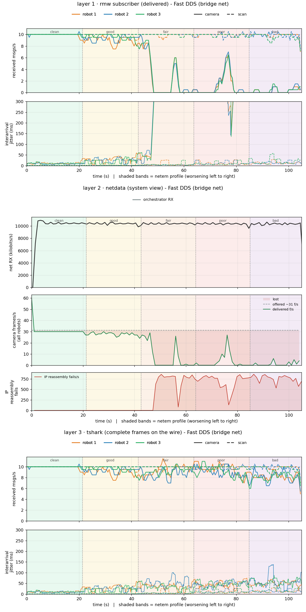
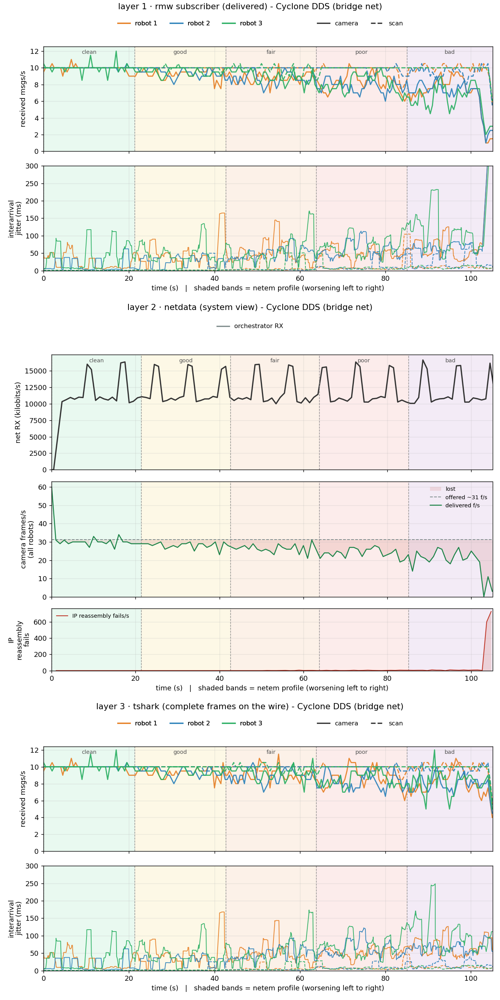
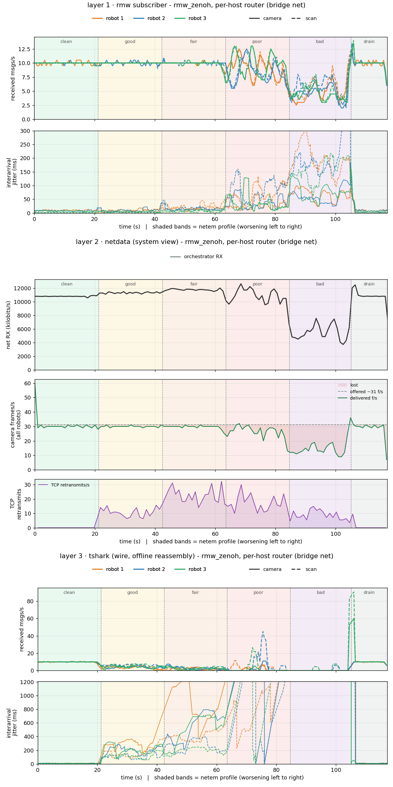

# Beyond the wire

A packet capture shows what crossed the link. It does not show what the
application received, or which frames died in the kernel before they got there.
Under loss those three numbers stop matching.

Nothing here is an exercise. These are recorded results from one netem ladder,
clean to bad, read three ways at once: the wire (tshark), the application
(rmw_subscriber) and the kernel (netdata). The figures and the analysis are
committed, so it reads without running anything.

The question it answers is whether the three tools agree, and where each one is
blind. They disagree in both directions, and which tool lies depends on the
transport.

It is also why lab 3 exists. Knowing a link dropped 2% of packets says almost
nothing about whether the robot kept working, and only the three layers together
answer that.

## Run conditions

| | |
|---|---|
| Measured | 2026-08-13 |
| Fleet | three mock robots plus an observer, on the Compose bridge network |
| Load | `sensor_msgs/CompressedImage` at ~41 KB and 10 Hz per robot, plus a `LaserScan` control topic |
| Impairment | the default `netem_profile.sh` ladder: clean, good, fair, poor, bad |
| Layers | tshark, `../scripts/rmw_subscriber_probe.py`, netdata |

Host kernel version, hardware and the image tag the sweep ran against were never
recorded. Anything re-recorded should capture those up front.

Each robot's link is shaped while everything keeps running, and capture and
counting happen in one sweep, so all three layers see the same bands on the same
clock. With three robots at 10 Hz, a healthy camera aggregate sits near 30 frames
per second.

## Topics, QoS, and configs

Each robot publishes two topics: a compressed camera image at
`/robot_<i>/sensor_0/camera/image_comp/compressed`
(`sensor_msgs/CompressedImage`, about 41 KB per JPEG, 10 Hz) and a laser scan at
`/robot_<i>/scan` (`sensor_msgs/LaserScan`, 10 Hz). The camera is the large
payload that fragments and shows loss, while the scan fits one datagram and acts
as the control.

The subscriber reads both with best-effort, keep-last, depth 10. Best-effort is
deliberate, since DDS does not retransmit a dropped best-effort sample, so on Fast
and Cyclone a lost fragment is a lost frame. Zenoh carries the same best-effort ROS
QoS over a TCP session, which re-sends the bytes regardless, so it recovers frames
the DDS stacks drop. The transport configs the sweep loads are the Fast and Cyclone
profiles under `docker/rmw_configuration/` (robot 3 merged in as the lab2
`lab2_`-prefixed files) and, for Zenoh per-host, a per-host router client profile
(generated per topology now, rather than the committed file the sweep loaded then).

## The three layers

- **Layer 1, rmw subscriber (delivered).** An rclpy subscriber counts the frames
  the application actually receives. This is what a real consumer gets.
- **Layer 2, netdata (system view).** Three strips. The top is net RX throughput
  in bytes per second at the observer, the vantage a network monitor has. The
  middle is offered versus delivered camera frames per second, with the shaded gap
  being frames lost. The bottom is a repair strip showing where the transport is
  straining: IP reassembly failures per second for the UDP RMWs, TCP retransmits
  per second for Zenoh. Every strip is built the same way for each RMW.
- **Layer 3, tshark (frames recovered from the wire).** The pcap is analyzed
  offline for complete camera samples. For the UDP RMWs (Fast, Cyclone) offline
  reassembly has unlimited memory and time, so it counts every frame whose
  fragments all crossed the link: an upper bound on what any receiver could have
  delivered. For Zenoh, which runs over TCP, the same tool reads as a lower bound
  instead, because reconstructing an ordered message stream from a retransmit-heavy
  capture is exactly what loss breaks. The Zenoh section explains why.

## Fast DDS on the bridge network



Camera frames per second, mean and sample standard deviation across the 1-second
bins in each band. Offered load is a flat 30 f/s (three robots at 10 Hz).

| band | offered | delivered L1 | wire-complete L3 |
|------|--------:|-------------:|-----------------:|
| clean | 30 | 30.0 ± 0.3 | 30.0 ± 0.3 |
| good  | 30 | 28.3 ± 1.1 | 28.3 ± 1.1 |
| fair  | 30 | 27.9 ± 1.0 | 29.0 ± 1.9 |
| poor  | 30 |  4.5 ± 8.0 | 27.4 ± 2.7 |
| bad   | 30 |  2.5 ± 3.7 | 25.4 ± 2.8 |

Reading it:

- Through clean and good the numbers agree. With no loss, what the publishers
  offered arrived and was delivered.
- From poor onward delivered falls off a cliff, from about 28 f/s to 4.5 to 2.5,
  while the wire still carries 27 then 25 complete frames per second. The
  subscriber gets under a fifth of what physically crossed the link.
- The standard deviation carries its own signal. At poor the delivered rate is
  4.5 ± 8.0, a spread wider than the mean. That is the bursty loss showing up:
  frames arrive in short runs with dead gaps between them, so within one band the
  rate swings from near zero to almost normal while the average stays low. A total
  count would hide that.
- The kernel agrees with the application. The observer's own reassembled-frame
  count (from `/proc/net/snmp`) tracks delivered in every band, so two separate
  measurements of the same event line up.
- netdata throughput (top strip) holds near 10 Mbit/s the whole time, while the
  repair strip shows IP reassembly failures climbing from zero into the hundreds
  per second exactly as delivery collapses. Bytes keep crossing while frames die
  in reassembly.

## Cyclone DDS on the bridge network



| band | offered | delivered L1 | wire-complete L3 |
|------|--------:|-------------:|-----------------:|
| clean | 30 | 29.9 ± 0.7 | 29.9 ± 0.7 |
| good  | 30 | 28.2 ± 2.1 | 28.2 ± 2.1 |
| fair  | 30 | 26.1 ± 2.0 | 26.6 ± 1.9 |
| poor  | 30 | 23.9 ± 2.4 | 25.4 ± 2.5 |
| bad   | 30 | 23.6 ± 2.1 | 25.4 ± 2.6 |

Reading it:

- Cyclone degrades gently. Delivered falls from 30 to about 24 f/s across the
  whole ladder, where Fast dropped to 2.5 under the same shaping. That gap between
  the two RMWs is the reason the lab runs both.
- The repair strip is where it shows. IP reassembly failures stay near zero for
  Cyclone, a handful per second at bad against Fast's hundreds. So Cyclone's lost
  frames are not dying in the kernel. They die a layer up, at RTPS fragment
  reassembly, because Cyclone splits the sample with RTPS `DATA_FRAG` and keeps its
  datagrams closer to the MTU. That counter reads high for Fast and near zero for
  Cyclone.
- Delivered and wire-complete stay close (23.9 vs 25.4 at bad), so most of
  Cyclone's small loss is on the wire, not in the receiver.

## Why the layers split apart

Fast DDS sends the 41 KB compressed frame as one large UDP datagram. The sender's
kernel splits it into roughly 28 IP fragments. netem drops a small fraction of
packets (0.6% at poor), but a camera frame only survives if all 28 fragments
arrive, so sub-1% packet loss becomes much larger frame loss. The receiver kernel
cannot complete those datagrams, so they never reach the subscriber. This is Fast
DDS default behaviour, not an artifact of the simulation.

Cyclone fragments the sample itself with RTPS `DATA_FRAG` instead of leaning on IP
fragmentation, so a dropped packet costs one RTPS fragment rather than a whole
datagram, and the frame survives more often. That one difference accounts for the
whole gap between the two under an identical ladder.

So the layers count different things:

- **offered**: frames the publishers put out, a flat 30 f/s.
- **wire-complete (L3)**: frames whose fragments all crossed, recovered offline.
  An upper bound.
- **delivered (L1)**: frames a real-time receiver actually reassembled and handed
  to the application.

netdata's throughput strip sits above all of it. It counts bytes, and the bytes
keep flowing because only a few percent are lost, so on its own it cannot see
frames dying.

## Zenoh on the bridge network (per-host router)



Zenoh runs over TCP, so the failure mode is the opposite of the DDS RMWs. This
sweep also carries a sixth band, `drain`: after `bad`, the shaping is cleared and
the capture keeps running for ten seconds by default. It is the control for the whole
table, so start from that bottom row.

| band | offered | delivered L1 | wire-recovered L3 |
|------|--------:|-------------:|------------------:|
| clean | 30 | 30.0 ± 0.7 | 29.7 ± 1.5 |
| good  | 30 | 30.0 ± 0.4 | 10.8 ± 3.6 |
| fair  | 30 | 29.8 ± 1.0 |  6.0 ± 4.2 |
| poor  | 30 | 26.9 ± 3.6 |  2.6 ± 5.9 |
| bad   | 30 | 13.4 ± 3.2 |  0.0 ± 0.0 |
| drain | 30 | 29.9 ± 0.3 | 29.9 ± 0.3 |

Reading it:

- The application barely notices until `bad`. TCP retransmits the lost segments,
  so delivered holds at 30 f/s through good and fair where Fast had already
  collapsed to single digits. Zenoh trades loss for latency, and up to `poor` the
  trade is nearly free at the application. Only at `bad` does the retransmit load
  finally cost delivered frames, and it falls to 13.
- The wire tool tells the reverse story. Layer 3 collapses immediately, from 30 to
  11 to 6 to under 3, and reads zero through `bad`. This is not frames being lost.
  It is offline dissection failing. tshark reconstructs each Zenoh message from an
  in-order TCP byte stream, and under loss that stream is a mess of out-of-order
  and retransmitted segments (this capture holds 11k out-of-order and 17k
  retransmitted segments). The dissector loses message-boundary sync and drops a
  run of messages until the stream settles, which hits both the large camera frame
  and the tiny scan.
- The `drain` band is the proof. Clear the shaping and both layers snap back to
  30 f/s in lock step. The frames the wire tool could not recover mid-sweep were
  never lost. They crossed late, and once the link is clean the backlog flushes
  and dissects cleanly. Layer 3's own interarrival panel shows it: jitter climbs
  past a second under load, then drops back at the drain.

So Fast and Zenoh are opposite blind spots. On Fast the wire looks healthier than
the application, because complete frames physically crossed that a real-time
receiver could not reassemble in time (L3 above L1). On Zenoh the wire tool looks
sicker than the application, because the transport delivers everything in order
while the offline analysis cannot keep up with the thrashing stream (L3 below L1).
On a reliable transport you cannot read application delivery off a packet capture.
The capture degrades under the same loss the transport is busy hiding, so layer 1
is the ground truth and the wire number is a floor.

The layer-2 repair strip carries the transport cost that layer 3 cannot. Where the
UDP RMWs show IP reassembly failures, Zenoh shows TCP retransmits per second
climbing through the ladder. Those retransmits are the price of the recovery: the
bytes are re-sent until they arrive, so the application keeps its frames and pays
in latency instead. That latency, not lost frames, is what finally drags delivered
down at `bad`.

## Network shaping

The netem profile is applied in both directions on every robot: egress on `eth0`,
ingress redirected to a per-container `ifb0`. Loss is bursty (Gilbert-Elliott
`gemodel`) and jitter is heavy-tailed (`paretonormal`), which matches real wireless
better than a flat drop rate. The same profile goes on all robots, so no RMW is
favoured. The ladder stays in the sub-1% loss knee, because a 28-fragment frame
cliffs sharply right there.

| band | delay | loss (bursty) |
|------|-------|---------------|
| clean | none | none |
| good | 5 ms ±1 | 0.2% |
| fair | 10 ms ±3 | 0.4% |
| poor | 20 ms ±6 | 0.6% |
| bad | 35 ms ±10 | 0.8% |

Because shaping is bidirectional, one-way best-effort traffic (camera, scan) pays
the loss once on egress, while anything that round-trips (reliable DDS repair, TCP
ACKs) pays it on both legs.

## Why the central Zenoh router is left out

`rmw_zenoh` in client mode routes every robot's raw image out to a central router
and back. Under the same ladder the raw round-trip dominates the outcome, so the
plot shows the shaping instead of anything about the RMW. It is excluded for that
reason. The per-host Zenoh router keeps the raw image local and only sends what a
remote peer needs, so it stays in the comparison.

The central-router mode is no longer in the harness, and its cost is why it was
dropped. Zenoh clients have no peer-to-peer path, so the
JPEG republisher inside each robot pulls that robot's own 2.68 MB raw frames out
to the observer and back. Those frames cross the shaped link twice before
compression, so an impairment profile hits the raw source as well as the
compressed stream and the cross-RMW comparison stops holding: Cyclone, Fast DDS
and `perhost` all keep that hop inside the robot. It also swamps a live capture.
A measured run filled a 200 MB budget every 1.25 seconds, against 1.5 MB/s under
`perhost`.

## Why the labs shape a bridge and not a routed AP

A shared access point sounds more realistic than the Compose bridge, and the routed version
was built and measured before the labs settled on the bridge. Every robot and the console
sat on its own subnet with a `wifi-ap` router as the only path between them, so all
robot-to-robot and robot-to-console traffic crossed one shaped budget, with a fixed
per-frame airtime cost so chatty discovery traffic paid for the medium the way it does on
real wireless.

Across a 20-robot fleet the two shapes disagree. On the bridge each robot has its own budget
and all three RMWs run near full rate. Under one shared AP budget they contend for it, and
Cyclone and Fast DDS drop packets while Zenoh stays low.

That contention is real, but it belongs to the shared medium rather than the middleware, and
it moves all three stacks at once. The labs shape a per-robot link so that a difference
between two RMWs is attributable to the RMW. The routed topology itself lives in lab 3,
which shapes exactly this shared AP to study that contention head-on.

## Reading the figures

Each stacked figure reads top to bottom as layer 1, layer 2, layer 3, over one
time axis and the same shaded netem bands. In layers 1 and 3, camera is the solid
line, scan is dashed, and colour is the robot. Layer 2 shows the observer
aggregate as three strips.

## Watching two of these layers live

The sweep above is a batch run, but the subscriber and the system view both work
during a live `scripts/workshop observer capture start [N]` session, which is how
lab 2 uses them.

`../scripts/rmw_subscriber_probe.py` flushes on every arrival, so tailing its log shows
delivery as it happens:

```bash
tail -f lab2-on-the-wire/captures/live_<rmw>.arrivals.csv
```

One line per message, no long gaps. At three robots by two topics by 10 Hz,
expect roughly 55-60 lines per second once warm, and a real run measured 55.1
msg/s over 22 seconds, 593 camera and 616 scan arrivals. Watch the `topic` column under
loss: `camera` thins out while `scan` holds its cadence, which is the
fragmentation contrast counted at the receiver instead of on the wire.

netdata is opt-in, via `profiles: [netdata]` in `docker/netdata/netdata.yml`:

```bash
docker compose --profile netdata -f docker/netdata/netdata.yml up -d netdata
```

The dashboard is at <http://localhost:19999>. Under **Containers & VMs** each
robot and the observer appear as their own cgroup (`cgroup_mock-robot-1.cpu`,
`.mem`, `.io`, plus per-robot network), so it is real per-container use rather
than a host-wide average. The moment worth catching is that net RX throughput
barely moves under loss, since only a few percent of bytes are dropped, while IP
reassembly failures (UDP RMWs) or TCP retransmits (Zenoh) climb sharply. The
repair counters see frames dying that throughput alone cannot.

## How it was produced

The code that generated these figures has been removed from the repository. The
git history on this branch contains the original scripts if anyone needs to
resurrect the exact methodology; the figures in this folder are the durable
artifact.

See [lab 2's README](../README.md) for the topics, QoS and viewer mechanics this
assumes, and [`docker/webshark/README.md`](../../docker/webshark/README.md) for
capturing on real hardware.
