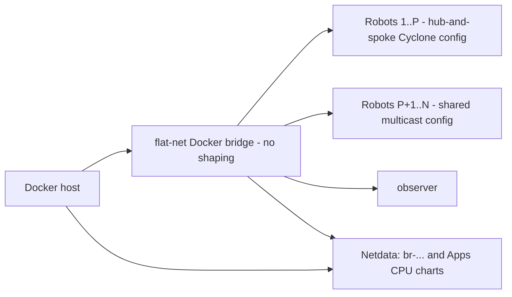
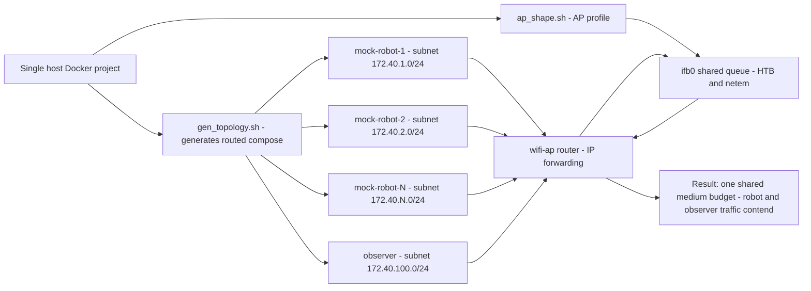

# Lab 3 — Stress Testing

**Goal:** extend Lab 2's low-level tools into operational detection and diagnosis for a
deployed fleet. This lab connects Lab 1's configuration patterns with Lab 2's capture
tools: first at a healthy, scaling baseline, then under a live shared-medium incident
that must be traced from a visible operator symptom back to its network root cause.
Lab 4 independently performs the repeatable experiments and RMW decision. This README
covers the setup, the topology, and the reference material behind the
[Exercises](#exercises) - it does not repeat their steps.

<a id="before-you-begin"></a>
<details>
<summary><b>Setup:</b> bring up the fleet and verify shaping modules</summary>

Run the core stack and verify the host has the shaping modules needed for the routed
shared-AP exercise. Run the commands below from the repository root and leave the core
stack up while working through the exercises. If you are not already there, run this
first from any directory inside the repository:

```bash
cd "$(git rev-parse --show-toplevel)"
```

Then run:

```bash
scripts/workshop -t flat up 3 cyclone
scripts/workshop preflight
sudo modprobe -a sch_netem ifb act_mirred sch_htb
```

Lab 3 starts on Cyclone DDS and stays there until [Exercise 4](exercises/4_repeat_with_zenoh.md)
switches to Zenoh. Pass the desired RMW when bringing up each topology so the deployment
is explicit.

Shaping is optional for the clean reference (`clear`), but the impaired profiles need
`sch_netem`, `sch_htb`, `ifb`, and `act_mirred`. If a module cannot be loaded, the
topology can still run, but its impairment results are not meaningful.

If `scripts/workshop preflight` reports a missing module, use the clean reference (`clear`) or a
recorded capture; the impairment exercises will not be meaningful.

Lab 3 uses two deployment phases, not two competing impaired topologies:

| Phase | Purpose | Network behaviour |
|---|---|---|
| Exercise 1: flat/pinned fleet | establish a healthy Netdata baseline while scaling a mixed-config fleet | pinned robots (hub-and-spoke Cyclone config) and default robots (shared multicast config) share the unshaped `flat-net` Docker bridge |
| Exercises 2–5: `routed` | diagnose a shared-medium incident | every robot and the `observer` operator container crosses `wifi-ap`; `ap_shape.sh` applies all delay, loss, and capacity controls to one shared AP queue |

The shared AP is Lab 3's only impairment model. Under that shared load, Cyclone DDS,
Fast DDS, and Zenoh can show different discovery, delivery, retransmission, and
freshness behaviour. Lab 4 owns the per-robot bridge-netem benchmark topology.

> **Shaping is x86_64-only** (`sch_netem` / `sch_htb` / `ifb` aren't in the Jetson L4T
> kernel). Where they're missing, the topology still runs (discovery + routing are
> unaffected) — only the impairment no-ops, with a `SKIP` note.

### If the routed path misbehaves

Before diagnosing an operator symptom in Exercises 2–5, verify the routed path itself:

```bash
scripts/workshop -t routed preflight
scripts/workshop -t routed netem
```

The routed diagnostic check (`lab3-stress-testing/scripts/routed_test.sh`) separates
container, route, IP, AP-transit, discovery, and data delivery failures. If the check
reports that the host is dropping routed traffic, review the host-wide warning and, if
appropriate for the workshop machine, run its suggested `forwarding disable-filtering`
command. Re-enable filtering afterward with `forwarding enable-filtering`, then rerun
the check.

### Do I need multiple laptops / a physical router?

**No.** The routed AP + `ap_shape.sh` (tc/htb/ifb) simulate the shared wireless medium on
**one host**, and `tc` is chosen precisely because it's **reproducible** — real Wi-Fi
gives every attendee a different answer. A physical multi-machine setup is more authentic
but adds large logistical cost and isn't required; the whole harness is designed to run on
a single (ideally beefy, for the larger fleet demonstration) machine.
</details>

<details>
<summary><b>Topology diagrams</b> </summary>

These diagrams show the healthy baseline and the one shared-medium impairment model.
Their source files are kept in [`diagrams/`](diagrams/) for slide artwork.

### Exercise 1: flat Docker bridge baseline

Every robot in the flat topology (`mock-robot-1..N`) sits on the same `flat-net`
Docker bridge; the pinned/default split is a discovery-config difference, not a
different container type. Robots 1..P run a hub-and-spoke Cyclone config (no
multicast, peered only with the observer); robots P+1..N run the default
shared-multicast config. There is no netem or AP in this phase: it introduces
Netdata's interface and process-group charts, and captures DDS discovery
activity as robots join.

Source: [`diagrams/mockfleet-baseline.mmd`](diagrams/mockfleet-baseline.mmd)



### Exercises 2–5: one shared AP budget

Source: [`diagrams/routed-shared-ap-netem.mmd`](diagrams/routed-shared-ap-netem.mmd)

The routed deployment isolates each robot and the `observer` operator container on its
own subnet behind `wifi-ap`. Traffic between subnets crosses the AP, where ingress from all AP-facing
interfaces is redirected into one `ifb0` queue containing the shared HTB and netem
profile. Robot-to-robot and robot-to-observer traffic therefore contend for the same
budget, so the impairment is shared across the fleet rather than isolated per robot.

Used in:

- [Exercise 2](exercises/2_watch_a_healthy_link_fail.md), for the live degradation and recovery demo.
- [Exercise 3](exercises/3_the_shared_medium.md), for the evidence-based diagnosis.
- [Exercise 4](exercises/4_repeat_with_zenoh.md), for the TCP transport comparison.

Cyclone/Fast DDS discovery (every peer's IP, so it changes with N) is generated
per run from `scripts/templates/*.xml.tmpl`; Zenoh's routed config is generated too,
but its content never depends on N (every node just connects to its own host's
router at `tcp/localhost:7447`). Inspect whatever the current run actually
generated - compose override included - with:

```bash
scripts/workshop -t routed netem
```



</details>

<details>
<summary><b>Lab flow</b></summary>

Exercise 1 applies the same two discovery patterns Lab 1 introduced per RMW — a
**default** config (multicast, no interface pinning — plug-and-play, but
chatty) and a **pinned** hub-and-spoke config (quiet, isolated, but
hand-wired, peered only with the observer) — to the flat topology's own robots,
generated fresh for the current fleet size by
[`ex1_gen_fixture.sh`](scripts/ex1_gen_fixture.sh). Robots 1..P
(`EX1_PINNED_ROBOTS`, default 3) get the pinned config; the rest get the
default config. Scaling the default cohort (`ex1_up.sh <N>`) is the one knob
Lab 1 didn't have: **more robots on the default config**, so the discovery
trade-off grows live in Netdata instead of just being read about. Watch for:

| Chart | What to watch |
|---|---|
| RTPS Discovery Multicast TX | RTPS multicast sent by each pinned robot (`mock-robot-1..P`) and the observer; it is a join/discovery signal, not a sustained throughput measurement |
| Default-Group Discovery Multicast TX | actual aggregate outbound discovery traffic from every default-config robot; observe its burst as robots join, not a linear steady-state rate |
| Default-Config Replicas | the number of default-cohort robots, so the aggregate discovery rate has a clear scale reference |
| Netdata `br-...` interface chart | built-in bandwidth and packet-rate charts for Docker's `flat-net` bridge, including every pinned and default robot |

Exercises 2–4 then move to the routed topology and turn an operator-visible degradation
into an evidence-based diagnosis, without producing an RMW ranking - that belongs to
Lab 4's repeatable comparisons. Build the evidence in order: **symptom -> monitoring
signal -> hypothesis -> confirming tool -> root cause**, across three independent
signal planes:

- **Lichtblick:** the operator symptom - stale ribbons, frozen, or jumping robots.
- **Netdata, Lab 3 AP:** shared throughput, qdisc drops, and queue backlog - whether the
  network path is under pressure.
- **Netdata, Apps CPU:** `lab3_robots` and `lab3_console` process-group CPU - whether
  local compute is the actual constraint.

Only when those disagree, or a hypothesis needs confirming, do the exercises drop to
`ros2 topic hz`/`echo --once` and, as a last resort, Lab 2's packet-inspection workflow
(`tshark` in the `wifi-ap` namespace).

---

### How the live fleet works

[Exercise 2](exercises/2_watch_a_healthy_link_fail.md) onward runs Lab 1's **mock
robot** at fleet scale, driven by an autonomous pilot, behind a single **operator
map** of all N robots. With a good RMW and settings the fleet glides; with a bad one,
poses arrive late or not at all and robots **freeze and jump** on the map. The freeze
is the metric: `state_freshness_ms` *is* the stutter you see. The reference below
explains how that map and its freshness values are produced, and what actually
crosses the shared AP - the mechanics behind every exercise from here on.

#### How the operator image and freshness values are produced

The operator map is rendered by `fleet_map.py` in the routed `observer` container, not
by Lichtblick. The map auto-discovers robot namespaces from `*/base_link` frames in its
TF buffer. For each robot it reads the most recent dynamic transform
`/<robot>/odom -> /<robot>/base_link` from `/tf`, which supplies the $x$, $y$, and yaw
used to draw the robot sprite and its trail. Each mock robot has an independent `odom`
origin, so the compositor places those local coordinate systems on a deterministic
4 m grid before fitting the combined image; the relative placement is illustrative,
while each robot's motion and freeze are real.

In the mock robot stack, `robot_localization`'s `ekf_node` publishes that moving
`/<robot>/odom -> /<robot>/base_link` transform. `robot_state_publisher` publishes the
robot model's fixed-link transforms on `/tf_static`. The launch files deliberately keep
`/tf` and `/tf_static` global rather than putting them under each robot namespace, so a
subscriber to `/tf` can receive transforms from every reachable robot. That is why a
`ros2 topic hz /tf` command inside one robot is an aggregate observation, not a clean
measurement of that robot's publisher.

At every 10 Hz render, the `observer` container calculates
$\text{state freshness} = \text{observer time} - \text{TF header stamp}$. It writes the
result in milliseconds into the top ribbon and publishes the same per-robot values as
`diagnostic_msgs/DiagnosticArray` on `/fleet_map/state_freshness`. Green means under
60 ms, amber is 60 ms through under 1 s, and red is at least 1 s; no received transform
is reported as `inf`. This is **received state age**, not a one-way network latency
measurement: it includes source publish timing, transport delay, queueing, and the
`observer` container's receive/render timing. The workshop containers share the host clock, which
makes this comparison meaningful in the supplied topology.

The compositor publishes both the raw `sensor_msgs/Image` on `/fleet_map/image_raw` and
a JPEG `sensor_msgs/CompressedImage` on `/fleet_map/image_raw/compressed`. The Lab 3
Lichtblick layout subscribes only to the compressed topic, so the visualizer receives
the rendered fleet image rather than every robot's individual image or TF stream.

#### What actually crosses the AP, and how to add load

Surprisingly little, by default. The operator map is built inside `observer` from `/tf`
alone, and Foxglove Bridge advertises every topic but only *subscribes* once a panel
opens one. So each robot's `scan` and camera are published to nobody:
`ros2 topic info /robot_1/scan` reports `Subscription count: 0`, and those messages never
reach the shared medium. A publisher does not create network traffic; a **subscriber**
does.

That makes [`scripts/fleet_inspector.py`](scripts/fleet_inspector.py) both the load lever
and the measurement used from Exercise 2 onward. Run from `observer`, it subscribes to
the sensor classes you select and reports, per topic, the receive rate, the age of each
message (its own timestamp versus arrival), p95 age, throughput, and stalls over 500 ms.

`--sensors none` is the default and adds nothing, so students can prove the tool is not
itself the load. `--sensors scan` is the light tier (~0.014 MB/s per robot).
`--sensors camera` is the saturating tier: one raw 850x1050 RGB stream at 10 Hz offers
roughly 214 Mbit/s into a 100 Mbit/s medium, which is why `--max-camera` defaults to a
single robot. The camera is switched off in the routed fleet by default - nothing
subscribes to it and compositing it is the largest CPU cost per robot - so enable it
deliberately with `MOCK_SENSOR_COUNT=1 scripts/workshop -t routed up <N> cyclone`.
`--qos reliable|best_effort` changes only the reader, which is enough to demonstrate the
QoS trade without restarting a robot.

Its columns are reproducible with stock tooling: `ros2 topic hz` for the rate,
`ros2 topic delay` for `age_ms` (it reads the same `header.stamp`), and `ros2 topic bw`
for throughput. The inspector adds what those cannot do - several robots at once, a p95
rather than a mean, stall counting, and a selectable subscription QoS. Exercise 2 walks
students through that comparison.

To change the *publisher* instead, edit [`scripts/qos/sensor_qos.yaml`](scripts/qos/sensor_qos.yaml).
The sensor publishers opt in to ROS 2 QoS overrides, so that params file retunes them with
no code change. QoS binds at publisher creation, and editing a bind-mounted file does not
change the container definition, so it takes a full `scripts/workshop -t routed down` and
`scripts/workshop -t routed up <N> cyclone` to
apply - not a plain `routed <N>`.

> **Lab 3 fleet viewer:** the routed command starts a plain Lichtblick image with one
> operator Image panel on `/fleet_map/image_raw/compressed`; it has no inherited Lab 1
> joystick/controller extensions or other panels.
> The raw topic remains available for inspection, but at 900x900 RGB and 10 Hz it is
> about 194 Mbit/s before middleware overhead, so it should not drive the live panel.
> The command loads [`lichtblick/fleet_operator.json`](lichtblick/fleet_operator.json).
> If a browser has retained an old layout, load it manually:
> - **Import (any Lichtblick):** *Layouts → Import from file →* select `fleet_operator.json`.
> The operator map is `sensor_msgs/Image` (`rgb8`) — Foxglove only forwards a topic once a
> panel subscribes. The raw 3D TF view is intentionally not the operator view: each robot
> owns a local simulation tree, which looks like overlapping or floating axes.
> Each mock robot owns an independent `odom` origin; the operator map places those origins
> on a deterministic 4 m grid so the robots start separated on one plane, and draws a trail
> behind each robot so its actual path remains visible.

### Why there's no live RMW flip

`RMW_IMPLEMENTATION` and every QoS setting bind at **node startup** — ROS 2 has no API
to renegotiate them on a running node, and the `observer` container must use the same
RMW as the robots. The network (`ap_shape.sh`) is therefore the only knob that changes
on a running fleet; comparing RMWs means recreating the routed topology instead
(Exercises 2 and 4 show both). See Exercise 2's "When it does not work" section for
viewer vs. fleet troubleshooting if the Image panel shows an empty grid.
</details>

<details>
<summary><b>Netdata:</b> stock charts first, Lab 3 extensions second</summary>

Use Netdata's stock charts first because they transfer directly to a real deployment:
**Network Interfaces** for host and Docker bridge traffic, **Apps CPU** for workshop
process groups, and the host's standard TCP/IP charts for host-network counters. Start by
correlating these signals on the same time range before adding a metric. Comparing
**Apps CPU** (`lab3_robots`/`lab3_console`) against **Lab 3 AP** answers the lab's
sharpest question at large N: is the bottleneck the shared network, or local CPU? The
full mock bringup (~11 nodes/robot) is deliberately heavy — at N=15–20 on a laptop, CPU
may become the limit, and Netdata is how you tell. The Lab 3 AP
queue lives inside `wifi-ap`'s network namespace, so the host Agent cannot see its `tc`
qdisc counters through its normal host-interface charts. Likewise, host TCP counters may
not show TCP retransmissions that occur inside a robot, AP, or `observer` container
namespace. Confirm what your Agent can see before relying on a stock chart for a
containerized deployment.

[`scripts/plot_contention.py`](scripts/plot_contention.py) can chart a saved
`ap_shape.sh sample` run as `contention_<rmw>_*.png` — the AP shared queue over time
(throughput ceiling, drop spikes, backlog) — for a report or slide rather than the
live dashboard.

### Workshop Netdata deployment scope

The workshop runs Netdata as a constrained container. It shares the host PID and network
namespaces so **Apps CPU** can group workshop processes, but it deliberately does not
mount the host cgroup hierarchy required for detailed per-container CPU, memory, network,
and I/O accounting. Docker socket access reports container state and health only. This is
a portability and host-access tradeoff, not a limitation of Netdata or Docker. A
host-installed Netdata Agent, or a containerized Agent with read-only host `/proc`, `/sys`,
and `/sys/fs/cgroup` mounts, can collect those per-container resource metrics.

Lab 3 adds only the signals the stock Agent cannot obtain directly:

| Extension | Source | Why it is custom |
|---|---|---|
| **Lab 3 AP** | `wifi-ap`: `tc -s qdisc show dev ifb0` | the one shared queue's backlog, drops, and configured profile are inside the AP namespace |
| **Lab 3 Fleet** | host collector: short outbound RTPS multicast captures per mock container | compares the deliberately mixed default and pinned discovery configurations at fleet scale |

The extension uses Netdata's built-in StatsD collector, not a custom dashboard service.
`docker/netdata/netdata.conf` enables UDP port 8125, while
`docker/netdata/statsd.d/lab3_ap.conf` and `lab3_fleet.conf` define the chart titles,
units, and dimensions. `scripts/ap_netdata.sh` runs in `wifi-ap`, samples the qdisc once
per second, and sends `lab3_ap.*` gauges to the Agent. `scripts/mock_fleet_netdata.sh`
runs on the host, gathers the mock fleet's discovery metrics, and sends `lab3_fleet.*`
gauges through the Agent. The Netdata Dockerfile copies both StatsD definitions into the
Agent image.

To extend Netdata in your own deployment, first identify the stock chart that answers
the question. When the value exists only inside an application or a network namespace,
write a small collector that reads the authoritative counter, calculates a rate from
successive samples when needed, and emits one StatsD metric per datagram to the Agent's
UDP listener. Add a matching `statsd.d` definition for its chart name, units, and
dimensions. Keep the custom metric close to the source and correlate it with stock host,
container, and interface charts rather than replacing them.
</details>

<details>
<summary><b>Mock robot vs bag:</b> which workload?</summary>

Each routed robot's workload is chosen with the `WORKLOAD` environment variable
(default `mock`), not a CLI flag - for example
`WORKLOAD=bag scripts/workshop -t routed up 15 cyclone`:

| | `WORKLOAD=bag` | `WORKLOAD=mock` |
|---|---|---|
| Data | real / bring-your-own MCAP | Lab 1's mock robot (procedural, drivable) |
| Setup | needs a bag in `docker/bags/` | nothing to download |
| Control class | recorded `cmd_vel` | live pilot `cmd_vel` (robots actually move) |
| Best for | fidelity, "prove it with *my* data" | the live fleet demonstration |

The mock robot is the **same primitive Lab 1 configures** — here it's prebuilt into the
image (`/mock_robot_ws`) and run at fleet scale, so Lab 3 builds directly on Lab 1.
</details>

<details>
<summary><b>AP Profiles</b></summary>

Lab 3 does not use Lab 4's `S0`–`S3` benchmark scenarios. Its routed fleet applies
named shared-AP profiles directly through [`ap_shape.sh`](scripts/ap_shape.sh):
`clear` for the unshaped reference path, then `good`, `degraded`, `lossy`, or `bad` for progressively
constrained shared-medium incidents. The profile catalog is separate from Lab 2's
per-link `netem_profile.sh` catalog because the AP also owns one shared rate budget.
Use `scripts/workshop -t routed netem <profile>` after bringing up the routed fleet.
</details>

## Exercises

### [1. Take the Fleet's Pulse](exercises/1_take_the_fleets_pulse.md)

Scale the default-config cohort up while the pinned spokes stay put. Watch the
trade-off grow live in netdata instead of just reading about it.

### [2. Watch a healthy fleet fail](exercises/2_watch_a_healthy_link_fail.md)

Move from the healthy `flat-net` baseline to the routed fleet. Apply a shared-AP
profile and observe the operator map degrade, then recover it.

### [3. The shared medium](exercises/3_the_shared_medium.md)

Use AP qdisc telemetry, container resources, ROS topic flow, and packet evidence to
locate the shared AP queue as the bottleneck rather than blaming a robot source.

### [4. Repeat the incident over TCP, using Zenoh](exercises/4_repeat_with_zenoh.md)

Repeat the routed shared-AP incident on a reliable byte-stream transport. Zenoh defaults
to TCP, which makes it the convenient vehicle; the subject is what TCP does to a fleet
under loss, and why an application-level QoS change cannot undo it.

### [5. After the workshop](exercises/5_after_the_workshop.md)

Push the scale further, monitor your own robot with Netdata, write your own netem
scenario, or prepare your own bag for Lab 4. No one else needs to be in the room.

---

## Next: Lab 4 — Benchmarking & Decision Matrix

Lab 3 is a live shared-medium diagnosis. Lab 4 runs repeatable Template A and Template
B comparisons: generated two-container traffic or identical MCAP replay, with no
applied impairment or controlled independent per-replica netem respectively. It never
drives the live mock fleet, so every RMW sees repeatable traffic.
