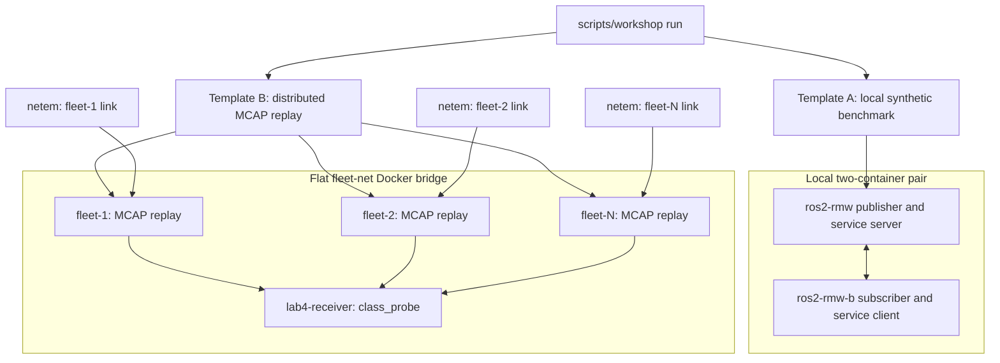

# Lab 4: Benchmarking and Decision Matrix

**Goal:** compare Fast DDS, Cyclone DDS, and Zenoh with a controlled workload under
clean and named impaired conditions, then combine the measurements into Pugh decision
matrices you can explain and apply to your own system. Lab 4 uses recorded workloads
and controlled scenarios so each RMW can be tested under the same declared conditions. Lab 3 supplies
operational diagnosis practice, but is not a prerequisite. This README covers the
deployment models, the data sources, and the reference material behind the
[Exercises](#exercises) - it does not repeat their steps.

Lab 4 uses the shared taxonomy and probe in
[`scripts/workshop`](../scripts/workshop), plus its own
[`scripts/`](scripts/) sweep and analysis tools. Template B replays the same bag for
every RMW. Replay controls the bag, duration, scale, and selected RMWs, but it does not reconstruct the original
discovery process, participant set, QoS negotiation, or wire traffic.

Lab 4 reuses Lab 1's generic multicast profiles. Specialized same-host shared-memory
files under [`scripts/discovery/`](scripts/discovery/) are optional reference material.

<b>Deployment Models</b>

Lab 4 does not run Lab 3's routed shared-AP incident topology. It uses two fixed
benchmark templates: Template A measures a minimal local topology, while Template B replays
the same MCAP on a flat fleet bridge. For impaired Template B scenarios, the harness
applies the selected netem profile independently to every fleet replica. The result is
a repeatable bad-link comparison, not shared-medium contention.

Source: [`diagrams/lab4-deployment-models.mmd`](diagrams/lab4-deployment-models.mmd)

<b>Data source</b>

| Option | Command | When |
|---|---|---|
| **Workshop-provided** | `scripts/workshop fetch-bag` | during the workshop |
| **Your own deployment** | drop a `.mcap` (+ its `metadata.yaml`) into `docker/bags/` | you have a representative recording and want the answer for *your* system |
| **Synthetic, make your own** | `scripts/workshop gen-bag` | no internet, or you want a bag tuned differently than the provided one |

> Bags are never committed to this repo (see `.gitignore`: `*.mcap` / `*.bag`). They are
> large binaries and every deployment's data is different anyway. Generate, fetch, or
> drop one in locally. Only the *results* (`comparison.md`, `pugh.md`, etc.) are meant
> to be kept.

[Exercise 1](exercises/1_same_traffic_different_rmw.md) fetches the workshop bag (or
generates the synthetic fallback if the release asset is unavailable) and runs both
templates against it. The generator creates one topic per class -
`/camera/image_raw` sensor, `/cmd_vel` control, and `/tf` state - with rates and sizes
documented in `scripts/gen_bag.py`. Either way, anything under `docker/bags/` is picked
up by `--bag`.

If `gen-bag` or a sweep fails with a permission error writing to `docker/bags` or
`docker/captures`, an earlier run left the directory owned by another user. The harness
keeps these writable automatically; if one is already root-owned, fix it once with
`sudo chmod 1777 docker/bags docker/captures`.

<b>How the comparison works</b>

The mandatory golden path is three RMWs, the workshop `benchmark` bag, 30 seconds,
and three Template B replicas. Run Template A S0 once, then Template B S0 and S2 with
those same RMWs and settings. S1, combined `constrained`, larger fleets, and extra RMW
variants are optional extensions.

Lab 4 supports two complementary templates:

- **Template A:** a minimal two-container benchmark on Docker's `robots-net` bridge,
    with no applied network impairment. For each RMW it generates an `Array1k`
    pub/sub stream at 1000 Hz using best-effort and reliable QoS, plus 200
    `AddTwoInts` service calls. It measures behaviour in this baseline topology without
    an MCAP.
- **Template B:** the same recorded workload replayed across a distributed fleet. It
    measures clean and named impaired behaviour with the bag, duration, scale, and RMW
    list held constant.

These are complementary deployment baselines, not two measurements of the same metric:

| Template | Deployment question | Measurements | Compare |
|---|---|---|---|
| A | What is the RMW's baseline cost and responsiveness in a simple local ROS 2 path? | Generated pub/sub maximum and mean latency, received rate, service RTT p99, receiver CPU | Cyclone vs. Fast DDS vs. Zenoh within Template A |
| B | Does the RMW deliver representative robot traffic acceptably across a small fleet? | Estimated sensor delivery shortfall, control arrival-gap p99, state maximum silence, sensor throughput, receiver CPU | Cyclone vs. Fast DDS vs. Zenoh within the same Template B scenario |

Do not compare a Template A number directly with a Template B number: their workloads
and metrics are intentionally different. Use Template B's clean `S0` and impaired
scenarios to compare the same fleet workload as only the network condition changes.

### Impairment Modes

The template's `harness.impairment` value selects how the runner treats the scenario:

| Value | Effect |
|---|---|
| `none` | No network shaping. Template A's A/B bridge pair uses this mode. |
| `per_replica_netem` | Apply the scenario's named Lab 2 `netem` profile, plus any rate cap, to ingress and egress of every Template B fleet replica. |

This models each fleet replica having its own impaired link. It is deliberately not
Lab 3's shared-medium model, where one `wifi-ap` queue is the common bottleneck.

### Network And Transport Details

Lab 4 does **not** use Lab 3's routed topology or its `wifi-ap` container. Each
template is a flat Docker bridge network: **Template A** uses `robots-net` for one
publisher/server container and one subscriber/client container; **Template B** uses the
separate `fleet-net` for the replay replicas and one unshaped receiver. In the impaired
Template B scenarios, `netem` is applied independently to each replay replica's link.
There is no AP, routed hop, or shared wireless queue in either template.

| RMW variant | Discovery and transport used in the standard Lab 4 runs |
|---|---|
| Cyclone DDS | Default Cyclone DDS multicast discovery on the flat Docker bridge. |
| Fast DDS | Default Fast DDS simple multicast discovery with its built-in UDPv4 transport. The containers have separate network and shared-memory namespaces, so its same-host shared-memory shortcut is unavailable. |
| Zenoh | Router-less peer mesh: multicast scouting discovers peers on the flat bridge, then peers connect using the default Zenoh transport. It is not configured to use TCP. |
| Zenoh (low-latency) | Optional Template B variant only: clients connect to a dedicated `zenoh-router` over `tcp/zenoh-router:7447`, with Zenoh low-latency unicast transport enabled. |

These are fixed benchmark conditions, not recommendations for production configuration.
They let the comparison exercise evaluate each RMW in a stated, inspectable deployment.
[Exercise 1](exercises/1_same_traffic_different_rmw.md) runs the Template A and clean
Template B `S0` cells; [Exercise 3](exercises/3_stressed_vs_clean.md) adds the impaired
`S2` (and optional `constrained`) cells. Every run writes to `docker/captures/<SWEEP_ID>/`:

| File | What |
|---|---|
| `comparison.md` / `.csv` | cross-RMW table, one section per (template, scenario) |
| `comparison.png` | grouped bars |
| `pugh.md` | weighted decision matrix (the deliverable) |
| `results.jsonl` | one structured row per cell |
| `<cell_id>.probe.json` | per-cell probe detail (Template B only) |

For Template B, `S0` is the clean reference. `S2` applies 30 ms +/- 10 ms delay and 5%
bursty loss. `S3` applies the `healthy` profile, which is 5 ms +/- 1 ms delay and 0.2%
bursty loss, plus a 20 Mbit/s per-replica cap. `constrained` applies 50 ms +/- 15 ms
delay, 1% bursty loss, and a 50 Mbit/s cap. These are complete profiles, not single
impairment labels. Keep the same bag, scale, duration, and RMW list when comparing
scenarios. Template A remains a local synthetic benchmark and does not apply netem.

Read evidence in this order: execution status and recorded shaping validity, expected
versus discovered/matched/received coverage plus silence, raw values and compatible
S0-to-stressed deltas in `comparison.md`, then the weighted matrix in `pugh.md`. A
missing value or invalid cell is not favourable
performance. Receiver workload CPU is sampled in the receiver container and is not
isolated middleware overhead. Estimated delivery shortfall uses bag metadata and replay
scheduling, so it is not packet loss. Arrival-gap percentiles describe observed
receipts, not source-timestamp latency, and cannot explain a stream that never arrived.

<b>Measured Metric Glossary</b>

`comparison.md` reports these template-specific measurements. Lower is better unless
noted otherwise. They are measurements of observed receipts and workload behavior, not
packet captures or a complete measure of middleware quality.

| Decision row | Template A | Template B | Meaning |
|---|---|---|---|
| Reliability (delivery) | Pub/sub maximum latency | Estimated delivery shortfall | A records the slowest generated pub/sub receipt. B estimates missing sensor messages from MCAP metadata and replay scheduling; it is not packet loss. Lower is better. |
| Latency (p99) | Service RTT p99 | Control arrival-gap p99 | A measures `AddTwoInts` request/response round-trip time. B measures the p99 time between received control messages, not source-timestamp latency. Lower is better. |
| Data freshness | Pub/sub mean latency | State maximum silence | A measures mean generated pub/sub receipt latency. B measures the longest gap between received state messages, including measurement-window boundaries. Lower is better. |
| Throughput / bandwidth efficiency | Received pub/sub rate | Received sensor payload rate | A reports generated messages received per second. B reports sensor payload received per second. Higher is better. |
| CPU overhead | Receiver workload CPU | Receiver workload CPU | CPU sampled in the receiving workload during the measurement window, not isolated middleware overhead. Lower is better. |

The remaining decision rows, loss/jitter behavior, ease of configuration, and discovery
robustness, are scored manually in [Exercise 2](exercises/2_read_the_matrix.md). They
start at a neutral score until you record evidence-based assessments.

<b>Read the Pugh matrix</b>

`pugh.md`'s weighted criteria ([`scripts/benchmark.yaml`](scripts/benchmark.yaml), `decision.criteria`)
combine template-specific measured metrics (`control_arrival_gap_p99_ms`,
`state_max_silence_ms`, `sensor_estimated_delivery_shortfall_pct`, `throughput_mbps`,
`cpu_pct`) with manually-scored criteria (ease of configuration,
discovery robustness) into one weighted score per RMW. Template A and Template B carry
**different weights**. Template A (single system) weighs CPU overhead and ease of config
higher. Template B (distributed fleet) weighs reliability and behaviour under loss/jitter
higher. `pugh.md` renders a separate matrix for each scenario, so clean and stressed
measurements are never silently averaged into one recommendation.

## Exercises

### [1. Controlled workload, different RMW](exercises/1_same_traffic_different_rmw.md)

Fetch the workshop bag, run Template A and clean Template B baselines, then retain their
run metadata for the controlled stress comparison.

### [2. Read the matrix](exercises/2_read_the_matrix.md)

Learn to read `pugh.md`: which criteria are measured, which are manual, and why Template
A and Template B assign them different weights.

### [3. Stressed vs. clean](exercises/3_stressed_vs_clean.md)

Run controlled clean and stressed Template B cells with the same MCAP. Does the
recommendation change when only the network condition changes?

### [4. Generate your own data](exercises/4_generate_your_own_data.md) *(optional)*

See where the workshop's benchmark bag came from, or make one of your own if you don't
have a representative MCAP yet.

### [5. After the workshop](exercises/5_after_the_workshop.md)

Bring your own deployment's real data, score the manual criteria for real, add a fourth
RMW variant, or automate the whole sweep as a regression check.
